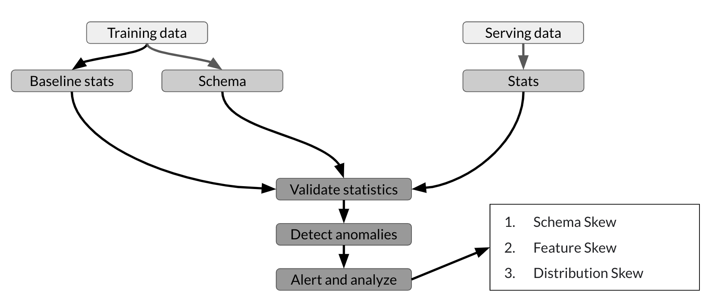
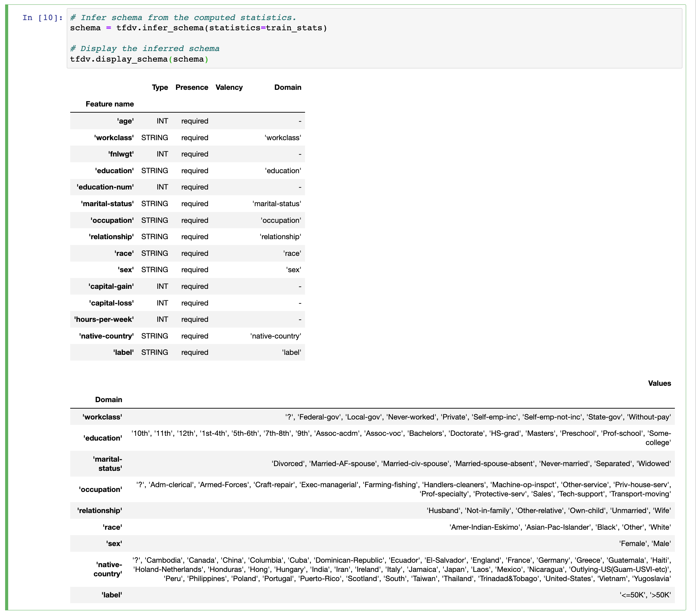
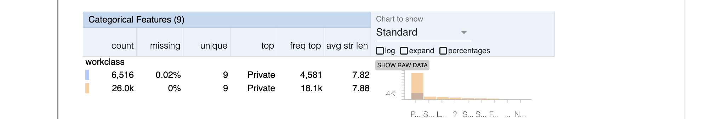
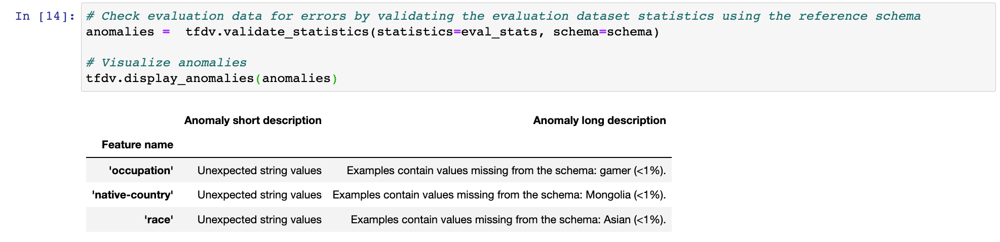
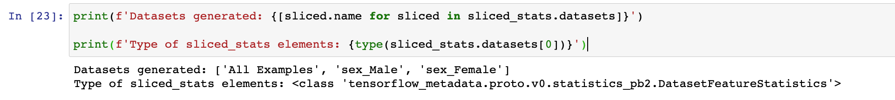
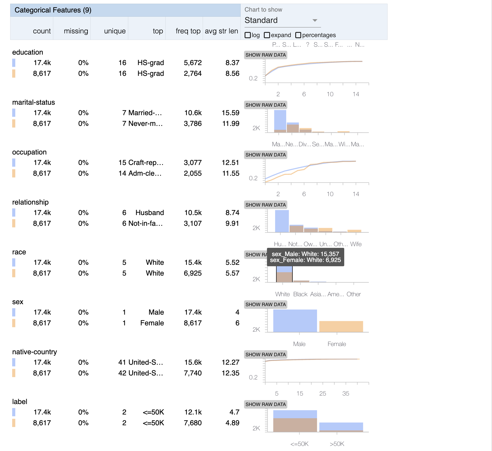

# TensorFlow Data Validation (TFDV)

???+ Note
    - The dataset used in this example below is the [Census Income Dataset](https://archive.ics.uci.edu/ml/datasets/Census+Income), a dataset that can be used to predict if an individual earns more than or less than 50k US Dollars annually 

## Overview

TFDV helps to understand, validate, and monitor production machine learning data at scale. It provides insight into some key questions in the data analysis process such as:

- What are the underlying statistics of my data?
- What does my training dataset look like?
- How does my evaluation and serving datasets compare to the training dataset?
- How can I find and fix data anomalies?



As shown, you can use TFDV to compute descriptive statistics of the training data and generate a schema. You can then validate new datasets (e.g. the serving dataset from your customers) against this schema to detect and fix anomalies. This helps prevent the different types of skew. That way, you can be confident that your model is training on or predicting data that is consistent with the expected feature types and distribution.


This tutorial will show you how to:

1. Generate and visualize statistics from a dataset
2. Detect and fix anomalies in an evaluation dataset


## Installation

```bash 
pip install tensorflow
pip install tensorflow_data_validation
```

## Visualize Dataset Statistics

You can compute your dataset statistics by using the [generate_statistics_from_dataframe](https://www.tensorflow.org/tfx/data_validation/api_docs/python/tfdv/generate_statistics_from_dataframe) method. Under the hood, it distributes the analysis via Apache Beam which allows it to scale over large datasets. In this example we have two datasets, a `train_df` and `eval_df`.

```
train_stats = tfdv.generate_statistics_from_dataframe(train_df)
```


TFDV accepts three input formats: TensorFlow’s TFRecord, Pandas Dataframe, and CSV file. This will generate stats on the following data types

<center>

| Numerical Data | Categorical Data   |
|:-:|:-:|
|Count of data records|Count of data records
|% of missing data records|% of missing data records|
|Mean, std, min, max|unique records|
|% of zero values|Avg string length|

</center>


To visualize the results, you can use [visualize_statistics](https://www.tensorflow.org/tfx/data_validation/api_docs/python/tfdv/visualize_statistics). This will show tables for both numeric and categorical features. Within this table you can see the frequency, percentage of missing values and some basic statistics.


## Create a Data Schema

Simply put, a schema describes standard characteristics of your data such as column data types and expected data value range. The schema is created on a dataset that you consider as reference, and can be reused to validate other incoming datasets. TFDV allows you to automatically generate an initial version of the schema using the [infer_schema()](https://www.tensorflow.org/tfx/data_validation/api_docs/python/tfdv/infer_schema) method. This returns a Schema protocol buffer containing the result. As mentioned in the TFX paper (Section 3.3), the results of the schema inference can be summarized as follows:

- The expected type of each feature.
- The expected presence of each feature, in terms of a minimum count and fraction of examples that must contain the feature.
- The expected valency of the feature in each example, i.e., minimum and maximum number of values.
- The expected domain of a feature, i.e., the small universe of values for a string feature, or range for an integer feature.

Note: TFDV will not automatically create a domain for numerical types.




## Comparing Train vs Evaluation Datasets

So right now we have made a schema for the training dataset (`train_df`). Now we need to generate statistics on the evaluation set (`eval_df`). The purpose of this is to allow you to compare statistics between the two sets to see if the values of the features lie within the same distribution. If not, then there is some type of skew occuring. TFDV allows you to do this by passing a few additional parameters to [visualize_statistics](https://www.tensorflow.org/tfx/data_validation/api_docs/python/tfdv/visualize_statistics). 

- `lhs_statistics`: Required parameter. Expects an instance of DatasetFeatureStatisticsList.
- `rhs_statistics`: Expects an instance of DatasetFeatureStatisticsList to compare with lhs_statistics.
- `lhs_name`: Name of the lhs_statistics dataset.
- `rhs_name`: Name of the rhs_statistics dataset.




As seen above, we can see that `age` do not share the same characteristics across the two datasets as min and max values are `0` and `1000` respectively. You can also see that 0.02% of the data is missing from the `workclass` feature.
We can remove any rows that do not fit our expected values


## Displaying Anomalies

We can use the reference schema that was made eariler to check for anomalies in the evaluation data. This is done using the `validate_statistics` and `display_anomalies` methods. Detected anomalies can either be considered a real error that needs to be cleaned, or depending on your domain knowledge and the specific case, they can be accepted. You can see below that TFDV caught a value for categorical variables that weren't expected. For example: some values in the `race` feature in the evaluation data wasn't in the schema. 



Lets say you encode these categorical variables and feed them as input features to the model, the model will break as the number of input features would not be the same as they were in training. You can see how catching anomalies like this is crucial for productionizing ML models.


## Updating the Schema

TFDV provides a set of utility methods and parameters that you can use for revising the inferred schema. This reference lists down the type of anomalies and the parameters that you can edit but we'll focus only on a couple here.

### Anomaly Detection Criteria

If you want to allow some anomalies up to a certain point can relax the criteria for raising anomalies by using the `distribution_constraints`. As described here under [`ENUM_TYPE_UNEXPECTED_STRING_VALUES`](https://www.tensorflow.org/tfx/data_validation/anomalies) the detection criteria is calculated by 

```
(num of features not in domain / tot values) > (1 - feature.distribution_constraints.min_domain_mass
```
In code this looks like:

```python
country_feature = tfdv.get_feature(schema, 'native-country')
country_feature.distribution_constraints.min_domain_mass = 0.9
```

### Adding New Domain Value

From our example earlier, imagine we want to actually have the value of `Asian` in our schema. This can be done with the following

```python
# Add new value to the domain of the feature `race`
race_domain = tfdv.get_domain(schema, 'race')
race_domain.value.append('Asian')
```

### Numerical Range Criteria

As mentioned earlier, TFDV doesn't automatically make a domain for numeric values. If you recall from the display of statistics earlier that there was an age value of 1000. We can set a min and max value for this feature using the `set_domain` method. Now we can be sure we catch anomalies like that again in the future.


If we run `validate_statistics` and `display_anomalies` again, after updating our schema and removing some anomalous rows, we can see that no anomalies are found.


## Data Slicing

TDFV allows you to analyze specific slices of your dataset, which can be used to see if each feature is well-represented in the dataset. For this example we will compare `male` vs `female` in the `sex` column. For this we used the [`slicing_util`](https://github.com/tensorflow/data-validation/blob/master/tensorflow_data_validation/utils/slicing_util.py) provided by TFDV. `None` in this context is used if you want to use the entire domain.

```python
from tensorflow_data_validation.utils import slicing_util
slice_fn = slicing_util.get_feature_value_slicer(features={'sex': None})
```

You need to tell TFDV that you need statistics for the features you set and you can do that through the `slice_functions` argument of [`tfdv.StatsOptions`](https://www.tensorflow.org/tfx/data_validation/api_docs/python/tfdv/StatsOptions).

```python
# Declare stats options
slice_stats_options = tfdv.StatsOptions(schema=schema,
                                        slice_functions=[slice_fn],
                                        infer_type_from_schema=True)
```


Generating sliced statistics only works for CSVs so you will need to convert the Pandas dataframe to a CSV. Passing the `slice_stats_options` to `generate_statistics_from_dataframe()` will not produce the expected results. Therefore, you will need to use `generate_statistics_from_csv()`

```python
# Convert dataframe to CSV since `slice_functions` works only with `tfdv.generate_statistics_from_csv`
CSV_PATH = 'slice_sample.csv'
train_df.to_csv(CSV_PATH)

# Calculate statistics for the sliced dataset
sliced_stats = tfdv.generate_statistics_from_csv(CSV_PATH, stats_options=slice_stats_options)
```

With that, you now have the statistics for the set slice. These are packed into a `DatasetFeatureStatisticsList` protocol buffer. You can see the dataset names below. The first element in the list (i.e. index=0) is named `All_Examples` which just contains the statistics for the entire dataset. The next two elements (i.e. named `sex_Male` and `sex_Female`) are the datasets that contain the stats for the slices. It is important to note that these datasets are of the type: `DatasetFeatureStatistics`. You will see why this is important after the cell below.



You can then visualize the statistics as before to examine the slices. An important caveat is `visualize_statistics()` accepts a `DatasetFeatureStatisticsList` type instead of `DatasetFeatureStatistics`. Thus, at least for this version of TFDV, you will need to convert it to the correct type.


```python
from tensorflow_metadata.proto.v0.statistics_pb2 import DatasetFeatureStatisticsList

# Convert `Male` statistics (index=1) to the correct type and get the dataset name
male_stats_list = DatasetFeatureStatisticsList()
male_stats_list.datasets.extend([sliced_stats.datasets[1]])
male_stats_name = sliced_stats.datasets[1].name

# Convert `Female` statistics (index=2) to the correct type and get the dataset name
female_stats_list = DatasetFeatureStatisticsList()
female_stats_list.datasets.extend([sliced_stats.datasets[2]])
female_stats_name = sliced_stats.datasets[2].name

# Visualize the two slices side by side
tfdv.visualize_statistics(
    lhs_statistics=male_stats_list,
    rhs_statistics=female_stats_list,
    lhs_name=male_stats_name,
    rhs_name=female_stats_name
)
```

As you can see below, we have a similar view of the data. However, this time the results are stratified by the different `sex` column values. You can see here that within this dataset `Male` is disproportionately more represented than `Female`.




As mentioned in our [MLOps documentation](../../operations/mlops/overview.md) data slicing is a useful method for asses your model for bias. These steps can be refactored for assessing slices of data after the model has produced output.


---


## References

- [TensorFlow Data Validation (TFDV)](https://www.tensorflow.org/tfx/tutorials/data_validation/tfdv_basic)
- [TFX: A TensorFlow-Based Production-Scale Machine Learning Platform](https://stevenwhang.com/tfx_paper.pdf)
- [Example Notebook](../../../resources/images/developer_handbook/data_validation/lab.html)
- [Medium: Data validation pipeline for production ML: Tensor flow data validation(TFDV)](https://medium.com/@deeptij2007/tensorflow-data-validation-tfdv-5e36fc74d19a)
