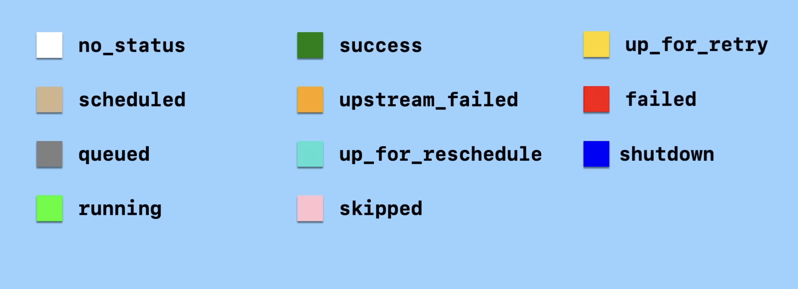
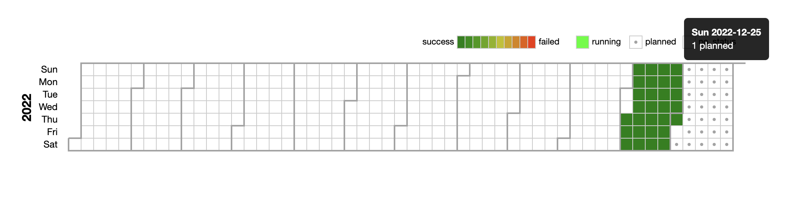
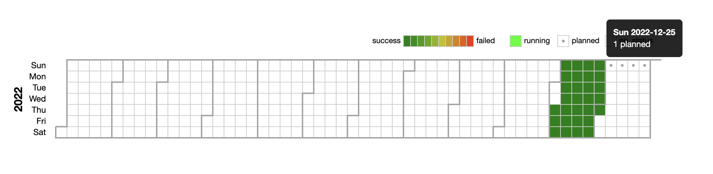
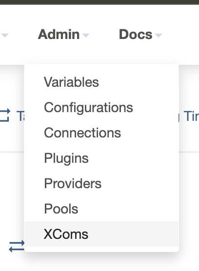
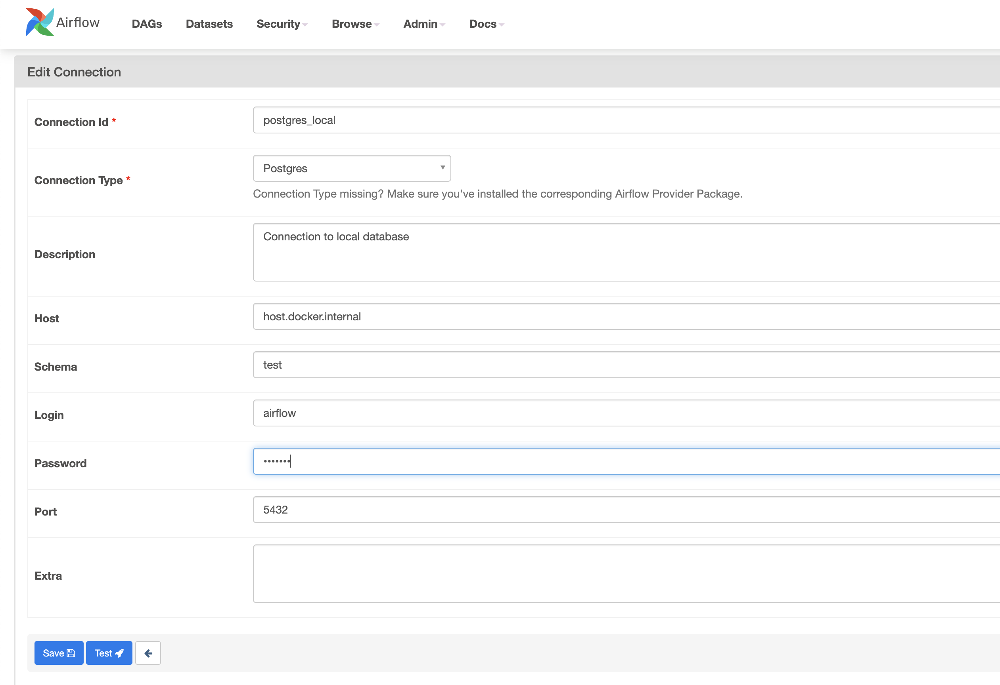
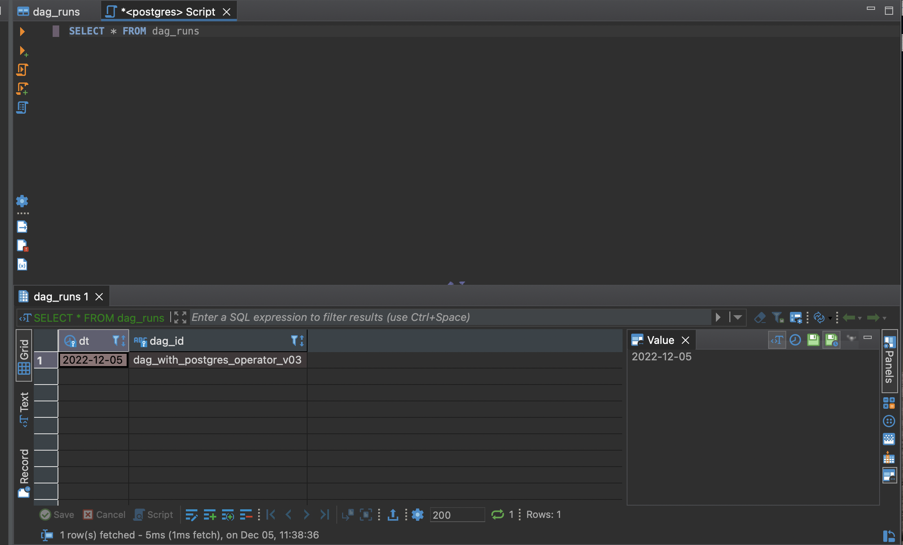
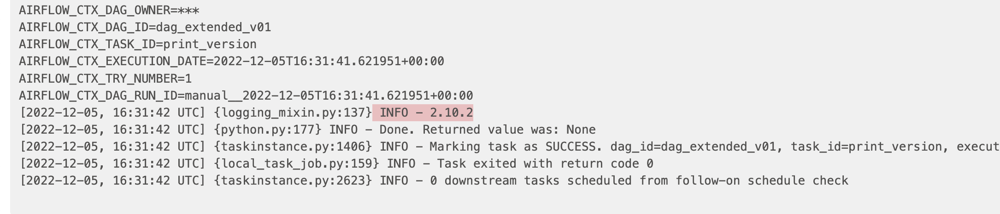
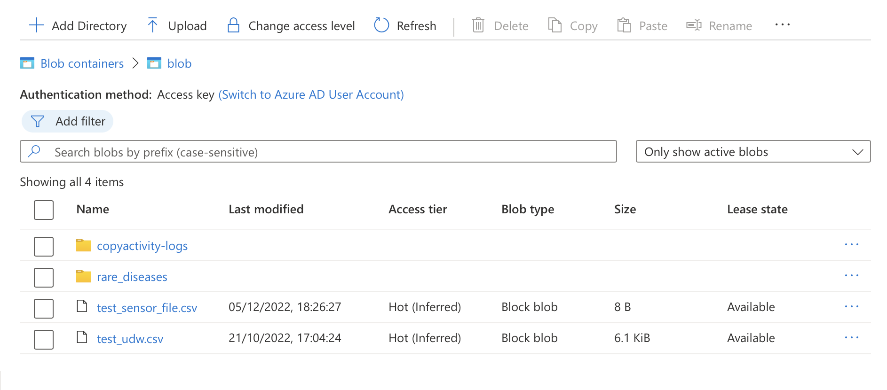
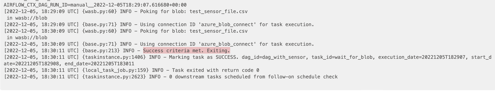

# Airflow


???+ danger "Prerequisites"
    - To use AirFlow it is required that you have basic knowledge of Python and Docker.
    - When downloading images from DockerHub you may need to disconnect from the company VPN.

## Overview
 
Apache Airflow is an open-source tool made by AirBnB for developing, scheduling, and monitoring batch-oriented workflows using code. Airflow’s extensible Python framework enables you to build workflows connecting with virtually any technology. A web interface helps manage the state of your workflows. Airflow is deployable in many ways, varying from a single process on your laptop to a distributed setup to support even the biggest workflows. Airflow follows a "workflow-as-code" principle. Traditionally, using Cronjobs was the default for scheduling events. However, some issues with this approach include poor failure handling, difficulty monitoring current and past processes and lack of scalability. Airflow aims to remedy these issues.

???+ success "Some nice features"
    - Can handle upstream/downstream dependencies gracefully. For example: if a step is dependent on another previous step to complete, it won't run until it passes successfully. If a  prior task fails Airflow can automatically retry that step.
    - Easy to see historical workflow runs
    - Ease of deployment - easy [integration with other technologies](https://airflow.apache.org/docs/#providers-packagesdocsapache-airflow-providersindexhtml). You can also create your own provider packages.
    - You can implement trigger event to spin off tasks

---

## Core Concepts

### DAGs
A workflow in Airflow is represented a direct acyclic graph (DAG). A DAG is a collection of all the tasks you want to run, and in what order. Read more [here](https://airflow.apache.org/docs/apache-airflow/1.10.13/concepts.html?highlight=dag#dags) 


### Tasks

So what is a task within a DAG? A task is defined as a unit of work. Represented as a node in the DAG graph. Tasks are written in Python. As you can see the graph above, task C is a downstream task of task A. 

### Operators

Operators call the thing you want to run. This could be a shell script, a bash command, a python script etc. There are many operators that can be used, and you can use multiple operators types within a DAG.
 


???- tip "Some terminology"
    - **Dag Run:** An instantiation of a DAG <br>
    - **Task Instance:** Specific point in time a task is executed <br>
    - **Execution Date:** Date and time when a dag run occurred <br>

### Task Lifecycle

There are 11 different states a task can be in, and these are represented with status colours within the dashboard UI. This tells us if there was any issues with the specific task, if it was successful and more. Read me [here](https://airflow.apache.org/docs/apache-airflow/1.10.13/concepts.html?highlight=task%20status#task-lifecycle)



The **scheduler** within Airflow will take each task and determine which state it should be in. If there was no upstream issues, the task will be scheduled. From there it is picked up by the **executor** and queue it to be executed by the **worker**. Once complete, the task will be marked as success or failed.


If the task is failed, or is prematurely cancelled, it will be marked as **up for retry** state. It will then become rescheduled for execution.


---

### Architecture


- **`WebServer`**: Used to serve the Airflow user interface.
- **`User Interface`**: Used to manage DAGs within a dashboard.
- **`Scheduler`**: Used to queue up new tasks for the Executor
- **`Workers`**: The component responsible for executing the task
- **`DAGs`**: Python files listing out workflows. These are visible by the UI, Scheduler, Workers and Executor
- **`Executor`**: The component that executes the task the has been queued.
- **`Metadata DB`**: In order for Airflow to be aware of the past and current state of the DAG, metadata is stored in a database. This can be an SQLite, MySQL or Postgres.
- **`airflow.cfg`**: The setup is configured by a data engineer within this file. This includes what DB to use, type of executor etc. 


## Installation

Official documentation [**here**](https://airflow.apache.org/docs/apache-airflow/stable/start.html)

```bash
# Airflow needs a home. `~/airflow` is the default, but you can put it
# somewhere else if you prefer (optional)
export AIRFLOW_HOME=~/airflow

# Install Airflow using the constraints file
AIRFLOW_VERSION=2.4.3
PYTHON_VERSION="$(python  --version | cut -d " " -f 2 | cut -d "." -f 1-2)"
# For example: 3.7
CONSTRAINT_URL="https://raw.githubusercontent.com/apache/airflow/constraints-${AIRFLOW_VERSION}/constraints-${PYTHON_VERSION}.txt"
# For example: https://raw.githubusercontent.com/apache/airflow/constraints-2.4.3/constraints-3.7.txt
pip install "apache-airflow==${AIRFLOW_VERSION}" --constraint "${CONSTRAINT_URL}"

# The Standalone command will initialise the database, make a user,
# and start all components for you.
airflow standalone

# Visit localhost:8080 in the browser and use the admin account details
# shown on the terminal to login.
# Enable the example_bash_operator dag in the home page
```

## Setup Docker

You can run Airflow within a virtual environment and conda environment. However, Docker is the most suitable choice.
There are two approaches you can take for spinning up Airflow within a docker environment:

### 1. Puckel/docker-airflow
This provides an automated build of Docker for Airflow, and is suggested in the Microsoft documentation. However, this can be intimidating if you have never used Airflow before. It's worth mentioning that it appears to no longer be supported, therefore it is riddled with deprecation warnings. See github repo [here](https://github.com/puckel/docker-airflow). The main commands you will need:

```bash
docker build --rm --build-arg AIRFLOW_DEPS="datadog,dask" --build-arg PYTHON_DEPS="flask_oauthlib>=0.9" -t puckel/docker-airflow:latest .

docker run -d -p 8080:8080 puckel/docker-airflow webserver
```


### 2. Official Docker Compose
Airflow provide a docker run-through, but give the warning that it would be difficult to configure this if you are not experienced with docker. See Official documentation [here](https://airflow.apache.org/docs/apache-airflow/stable/howto/docker-compose/index.html). You can run through this setup guide. Unless you are using a Windows machine, you will need to run this command before spinning up anything:

- `echo -e "AIRFLOW_UID=$(id -u)" > .env`

Here are the most useful commands you'll need:

- `docker-compose up airflow-init` need to run the first time your initializing the DB and base container.
- `docker-compose up` will spin up the containers in the background (add `-d` to run in background and free up the terminal)
- `docker compose down` will shutdown and clear all containers (add `-v` to remove all containers)


## How To:

### Schedule a DAG


```python
with DAG(dag_id = "example_dag", 
        default_args = default_args, 
        description = "example dag",
        start_date = datetime(2022, 11, 2, 12, 51), #12:51 pm 2nd December 2022
        schedule_interval = "@daily"
    ) as dag:
```

You can schedule in what interval you would like to run a DAG, [see here](https://airflow.apache.org/docs/apache-airflow/1.10.1/scheduler.html#dag-runs) different cadences you can set the scheduler to run. This defined using the `schedule_interval` argument.



It's worth noting that if you change the frequency of the DAG run, the metadata store will still persist the history of the previous runs, and highlight the future planned runs. You can see this in the calender tab of the dashboard. See the image below, where the cadence has been set to weekly.



You can also use CRON expressions to set the cadence of when the DAG will run. See [here](https://crontab.guru/) for help on creating cron expressions. Again, you use the `schedule_interval` parameter for this:
```python
schedule_interval = "0 0 * * *"
```

### Make a DAG


Lets say we want to make a DAG made up of tasks like the one shown above. Making a task can be easily done by instantiating the desired operator for your usecase. In this example below, we have 5 tasks using the `BashOperator` for executing bash commands, and the `PythonOperator` which has the ability to invoke python methods.

```python
task_one = BashOperator(
    task_id = "task_one",
    bash_command = "echo hello world "
)

task_two = BashOperator(
    task_id = "task_two",
    bash_command = "echo task 2"
)

task_three = BashOperator(
    task_id = "task_three",
    bash_command = "echo task 3"
)

task_four = BashOperator(
    task_id = "task_four",
    bash_command = "echo task 4"
)

task_five = PythonOperator (
    task_id = "task_five",
    python_callable = some_function,
    # protip: you can pass variables to the function you call 
    # within the PythonOperator using the op_kwargs parameter
    op_kwargs={'string': 'Hello'}
)
```

So now that we have defined our individual tasks, we need to link them up into a directed graph. This can be done a number of ways. Traditionally, you would have used the `.set_upstream()` and `.set_downstream()` functions to indicate that the task object is dependent on another task object. 

```python
task_one.set_downstream(task_two) 
task_one.set_downstream(task_three)
task_two.set_downstream(task_four)
task_three.set_downstream(task_four)
task_four.set_downstream(task_five)
```

Alternatively, since Airflow 1.8, this can be done with the Python `>>` and `<<` operators. This is called [BitShift Composition](https://airflow.apache.org/docs/apache-airflow/1.10.3/concepts.html?highlight=trigger#bitshift-composition).

```python
task_one >> [task_two, task_three]
task_two >> task_four
task_three >> task_four
task_four >> task_five

```

There is a shorthand way of doing this using what's known as the Task Flow API. By using python decorators you can considerably decrease the code line-count. This approach isn't as verbose as the previous, so knowing where dependencies and flow of the tasks are not as intuitive. 

```python
from airflow.decorators import dag, task

@dag(dag_id='taskflow_dag_v1',
    default_args=default_args,
    start_date = datetime(2022, 11, 2, 12, 51), #12 pm 2nd December 2022
    schedule_interval = "@weekly")
def hello_world_etl():

    @task()
    def get_name():
        return "Jonas"

    @task()
    def greet(name):
        print(f"Hello {name}")

    name = get_name()
    greet(name=name)

example_dag = hello_world_etl()
```

### Share Task Metadata (XComs)

Airflow gives you the ability to share information across different tasks using XComs (short for “cross-communications”). You can view the XComs table by navigating to `Admin` in the navigation bar.



Airflow Operators implicitly pass the context variable `ti`, which is specific to airflow and stands for **task instance**.
By default, every return value automatically gets added to XComs which can later be referenced in different task. You can also achieve this by using the `ti.xcom_push()` function.  Using `ti.xcom_pull()` you can pull the metadata that was added to xcoms by passing the `task_id`. In the example below the log output from task_two will be `"Hello, i am Jerry Seinfield!"`. It's worth mentioning that XComs is not for large data sharing, as the maximum XComs variable size is 48KB. So it should only be used for passing around strings or paths to larger files, not the data itself.

```python
def greet(ti):
    # print(f"Hello, i am {ti.xcom_pull(task_ids='task_one', key='name')}!")
    # OR
    print(f"Hello, i am {ti.xcom_pull(task_ids='task_one')}!")

def get_name(ti):
    # ti.xcom_push(key="name", value="Jerry Seinfield")
    # OR
    return 'Jerry Seinfield'

task_one = PythonOperator(
    task_id = "task_one",
    python_callable = get_name,
)

task_two = PythonOperator (
    task_id = "task_two",
    python_callable = greet
)

```

### Connect to a DB

Lets say we want to expose the database to Airflow to store some data or log some important values. Firstly we need expose some ports in our database so we can query it using DBeaver. Within the `docker-compose.yaml` expose the postgres instance using the port `5432`

``` yaml title="docker-compose.yaml"
services:
  postgres:
    image: postgres:13
    environment:
      POSTGRES_USER: airflow
      POSTGRES_PASSWORD: airflow
      POSTGRES_DB: airflow
    volumes:
      - postgres-db-volume:/var/lib/postgresql/data
    ports:
      - 5432:5432
```

Go to the `Admin` tab in the dashboard, and click `Connections`. Give it a connection name, this will be used to reference in the python code. You will see under `Connection Type` that we have a lot of different connections we can make. In this example we are using Postgres. When using docker you must use `host.docker.internal`, as `localhost` will not work in this instance. Lastly, provide the Airflow admin username and password and specify the `5432` port.



You have use the `PostgresOperator` to interact with Postgres resources within a DAG. In this example we simply connect to posgres and create a table called `dag_runs`, then add the data and DAG ID to a row in the table.  Note that the `{{ }}` symbols allow you to access environment variables, otherwise [known as macros](https://airflow.apache.org/docs/apache-airflow/1.10.5/macros.html), within Airflow. For example `{{ ds }}` corresponds with the date.

```python  title="docker-compose.yaml"
task1 = PostgresOperator(
    task_id='create_postgres_table',
    postgres_conn_id='postgres_local', #conn_id in dashboard: airflow/admin/connections
    sql="""
        create table if not exists dag_runs (
            dt date,
            dag_id character varying,
            primary key (dt, dag_id)
        )
    """
)

task3 = PostgresOperator(
    task_id='insert_into_table',
    postgres_conn_id='postgres_local',
    sql="""
        insert into dag_runs (date, dag_id) values ('{{ ds }}', '{{ dag.dag_id }}')
    """
)
```

You can see here DBeaver is used to query the database table and values we just created with airflow. 



### Install Python Packages

It's most likely the case that you will just be using Airflow to orchestrate jobs in different environments. In the case that you need to install some dependencies in your Airflow container then you will need to *extend* the Airflow image. For this example we will be installing DVC. Firstly, you need to make the two files as seen below. By stating `FROM apache/airflow:2.4.3` that means we are extending the base image, IE: adding a little something extra. We copy the `requirements.txt` and run a `pip install` which will make sure DVC is present in the docker container at runtime.

```txt title="requirements.txt"
dvc>=2.1.0
```

``` Dockerfile title="Dockerfile"
FROM apache/airflow:2.4.3
COPY requirements.txt /requirements.txt
RUN pip install --user --upgrade pip
RUN pip install --no-cache-dir --user -r /requirements.txt
```

Now that you have defined the dependencies, you need to build the image. <br>
This can be done using: `docker build . --tag <new_image_name>:latest` replacing `new_image_name` with whatever name you like.
You will now need to edit the `docker-compose.yaml`, replacing `apache/airflow:2.4.3` with the name you just created.

``` yaml title="docker-compose.yaml"
version: '3'
x-airflow-common:
  &airflow-common
  # In order to add custom dependencies or upgrade provider packages you can use your extended image.
  # Comment the image line, place your Dockerfile in the directory where you placed the docker-compose.yaml
  # and uncomment the "build" line below, Then run `docker-compose build` to build the images.
  image: ${AIRFLOW_IMAGE_NAME:-extended_airflow_image:latest}
```

Then run `docker compose up` to spin up the docker containers. Lets make a simple task that proves DVC has been installed successfully.

```python title="extended_dag.py"

def print_version():
    import dvc
    print(f"{dvc.__version__}")

task1 = PythonOperator(
    task_id='print_version',
    python_callable=print_version
)
```

You will see in the Airflow task logs that the version was printed out as expected. We have successfully extended our docker image.




### Sensors

A [Sensor](https://airflow.apache.org/docs/apache-airflow/stable/concepts/sensors.html) is a special type of operator that waits for event to occur. This is useful in cases where some task is dependent on a file, but you don't have certainty on when it will be available. You can view a list of the available Azure Sensor Operators [here](https://airflow.apache.org/docs/apache-airflow-providers-microsoft-azure/stable/_api/airflow/providers/microsoft/azure/sensors/index.html#module-airflow.providers.microsoft.azure.sensors).

In this example we will connect our local Airflow containers to the our teams Azure cloud subscription, and set up a listener to print "hello new file" when a new file appears within blob storage. Firstly, go to the Azure portal and find the blob container you'd like to apply the sensor to. Go to **Access Keys** and copy the **connection string**.

Go to the Airflow Dashboard and make a new connection. Make note of the connection ID because you will need to reference this in the python code later. Fill out the rest of form similar to the screenshot below and paste in the Azure connection string in **Blob Storage Connection String (optional)**


Within your python script, make a `WasbBlobSensor` object using the name of the container, the file its looking for. Make sure to give `wasb_conn_id` the connection ID you made earlier. 

```python
with DAG(
    dag_id='dag_with_sensor',
    start_date=datetime(2022, 12, 1),
) as dag:
    wait_for_blob = WasbBlobSensor(
        task_id="wait_for_blob",
        container_name = 'blob',
        blob_name = 'test_sensor_file.csv',
        wasb_conn_id  = 'azure_blob_connect'
    )
```

This task will run continously until the criteria has been met (that the "test_sensor_file.csv" blob/file is within the container). I manually uploaded a file to show what this would look like in the real world. You should see something like this in the logs for the file that was uploaded:







---

## Caveats
- Airflow is not meant to be used for streaming workloads, it is only used for batch processing. Look into Apache Kafka as an alternative.
- You need some coding experience to use Airflow, as its discourages to use the UI.


## References

- Airflow:
    - [How-to Guides](https://airflow.apache.org/docs/apache-airflow/stable/howto/index.html)
    - [Configuration Reference](https://airflow.apache.org/docs/apache-airflow/stable/configurations-ref.html)
    - [Connecting to Azure](https://airflow.apache.org/docs/apache-airflow-providers-microsoft-azure/stable/connections/wasb.html#howto-connection-wasb)
- Microsoft:
    - [Deploying Apache Airflow in Azure to build and run data pipelines](https://azure.microsoft.com/en-us/blog/deploying-apache-airflow-in-azure-to-build-and-run-data-pipelines/)
- Youtube:
    - [Airflow Tutorial for Beginners - Full Course in 2 Hours 2022](https://www.youtube.com/watch?v=K9AnJ9_ZAXE)


## Cheatsheet
- `airflow db init` to initialize the sqllite database, 
- `airflow users create` to make a new user
- `airflow scheduler` to turn on the scheduler
- `docker compose up` will start the scheduler, webserver, triggerer 

## Known issues

- `sudo chmod 666 /var/run/docker.sock`
