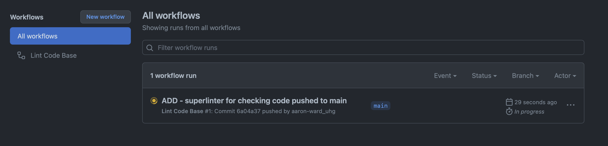
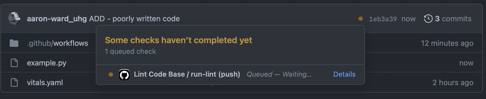

# GitHub Actions


GitHub Actions are built in  plugins that allow you to automate sepcific "actions" within your workflow. These are used to simplify development and reduce the amount of friction when making updates to code on a repo, IE: deploying an application. See official documentation [here](https://github.com/features/actions)


**Terminology:**
    

- `Workflow`: A yaml file listing out all of the automated steps
- `Events`: A trigger for jobs to run (ex: `on: push`)
- `Jobs`: A collection of steps that do something (ex `jobs: `)
- `Runners`: A container environment used to run our code and perform checks (ex: `runs-on: ubuntu latest `)
- `Steps`: A collection of sequential steps of actions (ex: `steps: `)
- `Actions`: An API that can be used to perform a task (ex: `uses: actions/super-linter@v3`)

    


## Use premade Actions

Rather than you trying to set up your own github actions workflow file, you can use prebuilt github actions by navigativing to the Actions marketplace
    

1. Click `Actions` tab
2. Use the `Search Workflows` search bar
3. Find the action you want to use. In this example i'll use `Super-linter` which is a automated linter that checks if python is formatted correctly.
4. Click `Configure`, and review the boilerplate yaml code placed into the file. Name the file as needed, but can be left to default.

    

5. Select `Start Commit`, add a description and select `Commit`.
6. Once this code reached the master branch, you will see in the Actions tab that there is a job building
    

7. You will be able to view job logs if you click into the workflow

    

The showcase how Actions are actually useful, we will show how a linter would catch poorly formatted code, and suggest changes to make sure the code being submitted follows conventions and standards. 

For example, in the code snippet below you can see that one of the functions are using camel casing (which isn't used in Python function naming) and there is no spacing between the functions.

```py title="bad_code.py"
    def ExampleFunction():
        """Example function"""
        return None
    def example_function_2():
        return True

    print(example_function_2())
```

You will see that the job is running in the background. The configured workflow is calling the Action to check the code 
    

Go view the logs to see what code failed against the linter. You can see below it will suggest what changes to make to the code.
    

Go back, check the code, make the suggested updates and push to the main branch again. You should see that the job will build successfully. The validated code is now present on the main branch.


## Set up your own Actions

1. Go to your repo
2. Select create new file. 
    

3. We need to be very specific with the naming, when typing, first enter `.github` + `/` + `workflows` + `/`. Then you can name the workflow file whatever you like. 
    

4. Write your workflow (may take a few attempts to get it working correctly)
5. `Commit`


## Request Action Approval

- If you aren't able to find what you need in the [UGH-approved actions](https://github.com/uhg-actions/Uhg-Marketplace-Readme/wiki), you can request to get one approved [here](https://github.com/uhg-internal/github-requests).
- The Action, if open source, must be registered with, and pass the license and vulnerability scan in [Barista](https://barista.optum.com/home) before it will be considered.
- When you have passed the scan, you can submit an Issue to request this Action be approved. Note: approvals may take some time.


## Recommended GitHub Actions templates

- There is a [list of internal Actions](https://github.com/uhg-actions/Uhg-Marketplace-Readme/wiki) you can use that have been approved by UHG
- Go to [actions template repo](https://github.com/uhg-internal/idp-github-actions-templates) to see find useful github workflow files to incorporate into your project repository.


---

## Useful Resources

- [Youtube: 5 Ways to DevOps-ify your App - Github Actions Tutorial](https://www.youtube.com/watch?v=eB0nUzAI7M8)
- [Blog: Github Actions— Everything You Need to Know to Get Started](https://towardsdatascience.com/github-actions-everything-you-need-to-know-to-get-started-537f1dffa0ed)
- [Blog: Using GitHub Actions for MLOps & Data Science](https://github.blog/2020-06-17-using-github-actions-for-mlops-data-science/)
- [Git Repo: Awesome Actions](https://github.com/sdras/awesome-actions)
- [Git Repo: starter workflows](https://github.com/actions/starter-workflows)