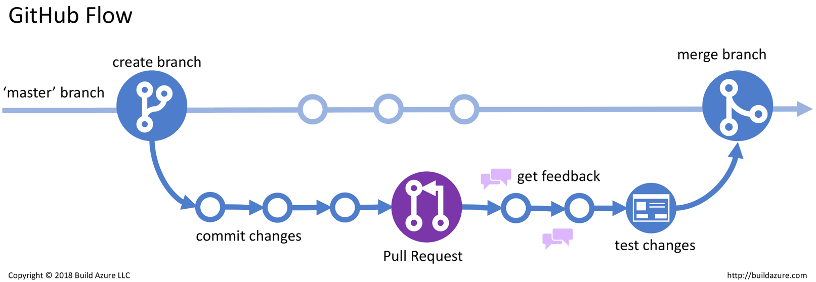

# Intro to Version Control with Git


## Overview 

### What is Git?

- Git is a version control system used for tracking changes in repositories of code​
- Why? Because humans are dumb and we make mistakes 🙂​
- Also we may want to revert back to older versions of code


### What is GitHub?​
- GitHub is the web interface for Git, and a place for us to view repositories of code. ​
- It also allows you to track progress, fork other peoples code, create organizations, do code reviews and manage projects. 

### Branching
Branches in github are an extremely useful resource for versioning code and scheduling reviews of code.

- A branch is a term for another version of the code base that can be worked on in isolation, until its ready to be merged with the main codebase, otherwise known as master (or main).
- A branch is usually created when you want to test out a new feature in your software​.
- Branches are a core concept with Git – you can test out new ideas and break whatever you want with affecting the “master” branch​.
- Branches follow a graph structure.




???+ danger "RULE OF THUMB:​​"
    
    Whatever is in your master branch should always be fully functioning and deployable - never push buggy or broken features to master​! CICD Pipelines can be used to enforce code quality and functionality.

---

## Basic Commands

### Cloning a Repo

```bash
git clone https://github.optum.com/<ORG>/<REPO>.git
```

### Checking and Creating your Branch

Inside the repo, check your current working branch by using ‘git branch’. Your current branch will have a star to the left of it.

```bash
git branch
* master
```

If you want to create a new branch, then use the checkout command. Any exisiting, unstaged modifications will be carried over to the new branch. Ideally, you want to create and switch to a new branch before any modifications are made. 

```bash
(base) LAMU02F93E6MD6R:DemoHarness cpaulisi$ git checkout -b cpaulisi-data-1 master
M       package-lock.json
M       src/pages/main-page.js
Switched to a new branch 'cpaulisi-data-1'
```

The current branch can then be verified.

```bash
(base) LAMU02F93E6MD6R:DemoHarness cpaulisi$ git branch
* cpaulisi-data-1
  master
```

### Switching your origin

The 'origin' in a git repo is the remote url where your repo is housed. This can be verified via the ```remote``` command:

```bash 
(base) LAMU02F93E6MD6R:DemoHarness cpaulisi$ git remote -v
origin  https://github.optum.com/cpaulisi/DemoHarness.git (fetch)
origin  https://github.optum.com/cpaulisi/DemoHarness.git (push)
```
If you wish to keep your code, but changes the remote url for where it's being pushed to (without having to re-clone the repo), then use the ```set-url``` command within remote:

```bash
git remote set-url origin https://github.optum.com/<ORG>/<REPO>.git
```

### Adding and Committing Changes


**Staging** 

Once changes have been made, file uploads happen via the add-commit-push pipeline. 
Adding a file is also known as **staging** a file. Specific files can be added (preferred), but directories can also be added as well. Always be a specific as possible with the files added to a commit. Adding directories blindly can get messy quick. Everyone's life is easier when commits are organized/consistent.

```bash
(base) LAMU02F93E6MD6R:DemoHarness cpaulisi$ git add example_file.py
```

**Commiting** 

Committing is synonymous with making a "save" of the current state of the code using the files in the staging area. Once selected files are staged they're committed using ```git commit -m```.

```bash
(base) LAMU02F93E6MD6R:DemoHarness cpaulisi$ git commit -m "ADD: Added data intro"
[cpaulisi-data-1 6da464b] ADD: Added data intro
 2 files changed, 25852 insertions(+), 38 deletions(-)
```

**Pushing**

After a commit is finalized, you must push this local commit to the remote machine.

```bash
$ git push
```

If no remote branch is set yet for the branch you're currently working on, you may have to create a remote branch before you can commit. You may
see an error such as this after a ```git push```:

```bash
fatal: The current branch cpaulisi-data-1 has no upstream branch.
To push the current branch and set the remote as upstream, use

    git push --set-upstream origin cpaulisi-data-1
```

As the error message suggests, this can easily solved with the alluded-to command:

```bash
(base) LAMU02F93E6MD6R:DemoHarness cpaulisi$ git push --set-upstream origin cpaulisi-data-1
Enumerating objects: 11, done.
Counting objects: 100% (11/11), done.
Delta compression using up to 6 threads
Compressing objects: 100% (5/5), done.
Writing objects: 100% (6/6), 254.15 KiB | 6.69 MiB/s, done.
Total 6 (delta 3), reused 0 (delta 0), pack-reused 0
remote: Resolving deltas: 100% (3/3), completed with 3 local objects.
remote: 
remote: Create a pull request for 'cpaulisi-data-1' on GitHub by visiting:
remote:      https://github.optum.com/cpaulisi/DemoHarness/pull/new/cpaulisi-data-1
remote: 
To https://github.optum.com/cpaulisi/DemoHarness.git
 * [new branch]      cpaulisi-data-1 -> cpaulisi-data-1
Branch 'cpaulisi-data-1' set up to track remote branch 'cpaulisi-data-1' from 'origin'.
```


### Checking the Status of your Modifications

Your exisiting modifications on your current branch can be checked using ```git status```.
Files respectively can appear as unstaged, staged, and committed.

Unstaged:

```bash
LAMU02F93E6MD6R:DemoHarness cpaulisi$ git status
On branch cpaulisi-data-1
Changes not staged for commit:
  (use "git add <file>..." to update what will be committed)
  (use "git restore <file>..." to discard changes in working directory)
        modified:   package-lock.json
        modified:   src/pages/main-page.js
```

Staged (_after ```git add```_):
```bash
(base) LAMU02F93E6MD6R:DemoHarness cpaulisi$ git status
On branch cpaulisi-data-1
Changes to be committed:
  (use "git restore --staged <file>..." to unstage)
        modified:   package-lock.json
        modified:   src/pages/main-page.js
```

Committed (_after ```git commit```_):
```bash
(base) LAMU02F93E6MD6R:DemoHarness cpaulisi$ git status
On branch cpaulisi-data-1
nothing to commit, working tree clean
```

<!--    -->


### Creating a Pull Request

After a commit on a branch is pushed to the remote, you can create a pull request that allows everyone on the project team to review changes.
On most repos, this is extremely self-explanatory, just nagivate to the github repo url. There, you'll see a notification that looks like this: 


From there, you can add reviewers, and specify the changes made in the pull request. 
In your pull request, you can view comments on code, mentions, and other information relating to the source material. 

**_Don't merge your pull request back into main/master or any other branch until all reviewers have approved the changes and you have discussed it with your team._**

After that, you can make the necessary changes to your pull request, including assignees, reviewers, checklists, and descriptions. When you're done, create the pull request.


### Creating a Pull Request (From a Fork)

If you are working on a forked repo you must specify that the pull request is to be attached specifically to the forked version of the repo. This is simple, just click on the "**Compare and pull request**" button on the notification pictured above. Then just changed the "base repository" to the forked version of the repo (your version, not the original).

In our case, this looks like changing this


to this


## Flow of Development

Now that you know the basics of how to interact with git, its good to mention how this can all be used to contribute to projects in an industry-standard fashon. Here are the steps:


  


1. Make changes locally
2. stage, commit and push to your branch
3. Submit a pull request
4. Have code reviewed and approved, address changes as needed.
5. If approved, merge the PR. This will spin a Jenkins or Github Actions CICD pipeline. This can include unit tests, format linting, test builds etc. to ensure code is at a production standard. This is the CI portion of "CICD". If tests fail then the merge is cancelled.
6. If the tests pass, the code is merged to the master branch.
7. A build should take place to promote the new code to the production code base. This is the CD portion of "CICD"


---

## Protips

???+ example ".gitignore files"

    - These tell git to ignore certain files that you don’t want to be pushed to the remote repository.​ These can be a saving grace​
    - use the [`**` wildcard](https://git-scm.com/docs/gitignore#_pattern_format) to ignore file types in multiple directories.
    - Make sure to use them in your repository​
    - Protip: you can autogenerate a `.gitignore` for the language you are using on GitHub.​

???+ example "Version control your code, not your data​"

    - Version control your code, not your data​
    - Large data or binary files should **never** live on a repository. Especially if it’s PHI/PII Data​
    - Testing data / files needed for some task is the exception.​

???+ example "Use informative commit comments​​"
    
    Don't use the default commit message given by Git, this make it hard to find specific changes and is generally bad practice. Provide a prefix along with a meaningful description of the changes.

    - `Git commit –m “ADD – added new function to perform regexes on label column​`
    - `Git commit –m “UPDATE – updated code to get 2 different regular expressions”​`
    - `Git commit –m “FIX – fix function that accidentally printed credit card details 😕“​`
    - `Git commit –m “<name of the user story you are working on>”`

???+ example "Always refresh your branches​​"

    - Always refresh your branches​. This means you should `git merge` master into your branch regularly​ to recieve up-to-date code.
    - You don’t want your branch going stale and falling too far behind develop and master.


## References

- Refer to this [cheat sheet](https://education.github.com/git-cheat-sheet-education.pdf) to quickly find the commands you need.