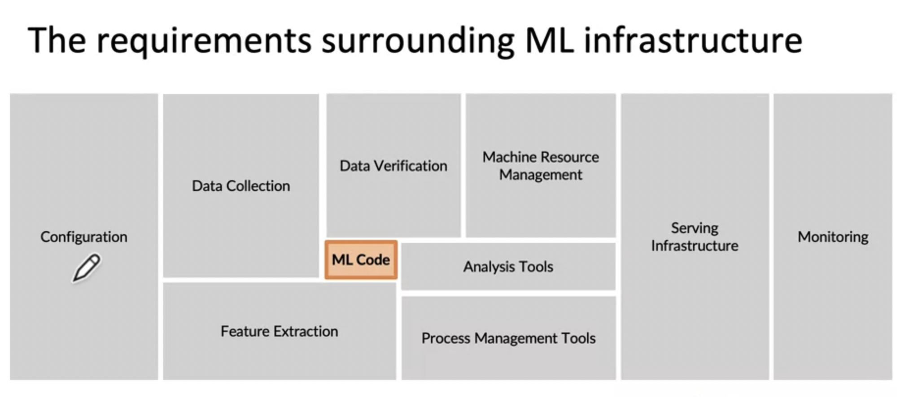
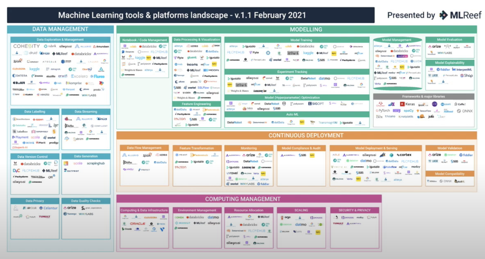
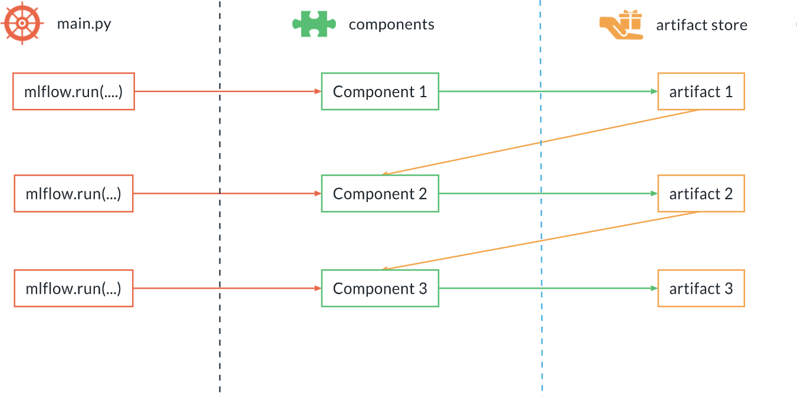
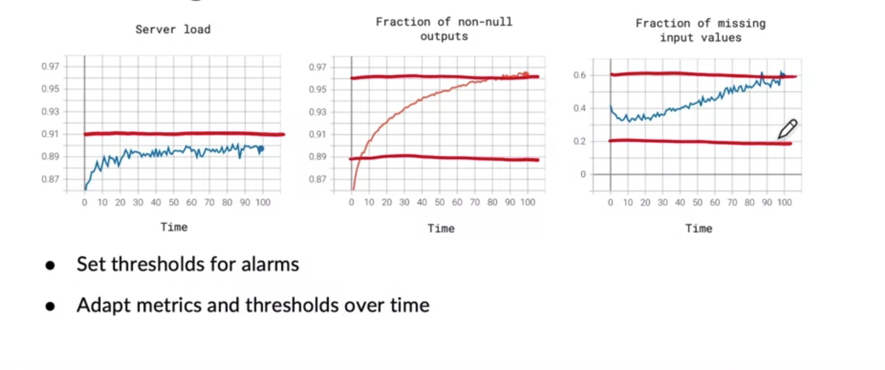

# Machine Learning Operations (MLOps)

???+ warning "Note"
    The topic of MLOps is an entire discipline on top of Machine Learning. This article aims to condense all of the core concepts into a single story. 


## The ML Lifecycle


Inspired by the [Software Development Life Cycle](https://www.tutorialspoint.com/sdlc/sdlc_overview.htm) (SDLC), the ML lifecycle aims to provide a framework around planning and development machine learning projects. ML practitioners who don't have any experience with MLOps may be familiar with a few of these steps such as EDA, data preprocessing, training and evaluation. However, this is only a portion of what it takes to make a production grade machine learning project. 

???+ danger "Steps"
    1. Data collection
    2. EDA
    3. Data cleaning (not model specific)
    4. Preprocessing (model specific, data segregation, feature engineering etc.)
    5. Model training
    6. Evaluation
    7. Deployment
        * Batch: setup environment for periodic runs for throughput
        * Service: a REST API environment can be set up to produce ML value on demand
        * Real-time (streaming): used for continous inference on a low latency data stream
    8. Monitoring
        * Performance drop? Repeat step 1


## What is MLOps? 
Software engineers have done a great job of establishing best practices for software engineering projects through the use of DevOps. However, as machine learning is a more iterative process, this needs to be altered to suit our needs. This is where ML Operations comes in.

ML Operations, or commonly referred to as MLOps, is a set off best practices for efficientend-to-end development and productionalization of machine learning projects. When dealing with MLOps, you will hear the word "*pipeline*" a lot. In essence, an ML Pipeline is just a sequences of independent, modular and reusable steps to achieve each part in the machine learning life cycle. This is essential for making a machine learning model usable. It's often the case the ML models, no matter how good the performance, never get used in the real world. 

> ***“70% accuracy on a model is infinitely better than 95% accuracy on a model that can’t be used in production”***

But by using MLOps principles we can avoid "racing to a redlight". The attributes of a good ML pipeline are:

- high performance
- scalability
- reliability
- automatation
- reproducibility

There are three "pillars" to a project that makes use of MLOps principles: 

1. The Data Pipeline (data ingestion, cleaning, sorting)
2. The ML Pipeline (processing, experimentation, testing)
3. The Deployment Pipeline (Inference, monitoring)


## ML Pipeline Stack




With respect to ML pipelines, there are a number of crucial concepts that need to be understood before attempting to build an MLOps Stack. The code used for modelling is only a small part in the grand scheme of things. Below are just brief descriptions of the concepts. We'll dig a little deeper into how these are implemented within this article. Obviously we can't test out every tool listed, but the following sections will show what we used. The concepts will remain the same so don't need to use the exact tools we did. These are the best practices that should be put in place so you can ensure you have a durable and robust MLOps pipeline. 


|**Attribute**| **Purpose** | **Description** |
|------------|------------|-----------------|
| **Data Validator**  | Automated Validation | This involved checking for data integrity and [data drift](https://towardsdatascience.com/why-data-drift-detection-is-important-and-how-do-you-automate-it-in-5-simple-steps-96d611095d93), Which is defined as a variation in the production data from the data that was used to test and validate the model before deploying it in production. |
| **Data Versioning**  | Reproducibility |Needed for tracking different snapshots of your data for experiments. Lets say you train a model 10 times, using different feature engineering techniques each time - if your data is version controlled then you can easily roll back to previous version of your data |
| **Experiment Tracker** | Reproducibility  | The concept of keeping track of all parameters related to model training such as hyperparameters, metrics, configurations, dataset paths etc. This is crucial for keeping a record of past experiments, and should never be deleted unless 100% centrain you won't need it again. |
| **Artifact Store**  | Reproducibility | Artifact tracking involves storing a record of the outputs from each component (step) in the pipeline such as models, images, datasets etc. |
| **Model Registry**   |  Deployment  | This is a centralized repository for storing your trained models. In production the inference pipeline will reference the lastest model that have been promoted to this registry.|
| **Model Monitor**   | Automated Validation | Model monitoring involved checking for model performance drift due to changes in the data. |
| **Pipeline Orchestrator**| Orchestration| Now that you have defined your stack, you need something that can actually define which componenets will be used, and when. Using an orchestrator tool can enable you to schedule automated runs of your data or ML pipeline|


There are also some optional attributes that can be integrated into your ML Stack. These are more of a "nice-to-have's" or are only required in certain circumstances. We wont cover these in the rest of the article, but they're good to be aware of. 

|**Attribute**| **Purpose** | **Description** |
|------------|------------|-----------------|
| **Alerter** | Automated Validation | Alerters allow you to send messages to chat services (like Teams, Slack, etc.) from within your pipelines. This is useful to immediately get notified when failures happen, for general monitoring/reporting, and also for building human-in-the-loop ML.
|**Feature store** | Reproducibility |Feature stores allow data teams to serve data via an offline store and an online low-latency store where data is kept in sync between the two. It also offers a centralized registry where features (and feature schemas) are stored for use within a team or wider organization.|



Its important to note that there are many tools used to achieve a good MLOps pipeline. Sometimes it may be difficult to find out what you should use. Also, a lot of these tools are not mutual exclusive, meaning that some tools can do multiple stack operations. For example, MLFlow can act as an experiment tracker and a model registry. A good website for reading up on the different options is [**https://mymlops.com**](https://mymlops.com). The list isn't extensive but its a good place to start and to see what integrates nicely together.


## Levels of MLOps Readiness

To understand where you are within the stages of bringing a ML project to production, its useful categorize the readiness of your ML Pipeline. For this we have 3 levels:

???+ failure "Level 0:"

	- Proof-of-concept 
        - In this stage the project is in proof-of-concept or expoloratory analysis phase
	    - Code is standalone, normally consisting of just notebooks 
        - Think “Kaggle competition”
    - Infrastructure is minimal or nonexistent at this stage
	- There is requirement for model monitoring, productionatization or inference, therefore MLOps not neccessary 
    - This is the lowest form of readiness, suited for smaller teams in the early stages

???+ warning "Level 1:"

	- At this level, there is some sort of pipeline emerging. More time is spent thinking about reusability and automation.
	- Scripts are organized reusable components (utilities)
	- Process of training models are standardised, making it easier for adding new models.
	- Artifacts are tracked, meaning there is some type of versioning on datasets or models
	- Ability to retrain models easily can prevent model drift.
	- Time to go to production is reduced. 
    - This level of readiness is required for small to medium sized teams and ML projects that are in development

???+ success "Level 2:"
	- Continuous integration and continuous deployment (CICD)
	    - Every change in the components that passes the tests is merged automatically 
		- Every change that passes the tests is released in the production pipeline
	- Continuous training
		- New pipeline is automatically triggered when model/data drift is found within the model monitoring tests
    - Rapid iterations on prod pipelines.
	- Customers see continuous improvements
	- This level of pipeline readiness is essential for large teams or projects that are supposed to go into production.

<!-- ### ------------------------ -->

## 1. Data Validation

When you're at [level 0](./overview.md#levels-of-mlops-readiness) of pipeline readiness, you would have likely extracted data manually from some datasource and done some exploratory data analysis to ensure quality and integrity of the data. This may include finding columns that are redundant, have erroneous or missing data. You would have gotten a sense of what the data should or shouldn't look like for your usecase. The same way that models training is iterative, so too should your data validation. Each time an extract occurs you should make sure you setup a process to preventatively catch problems in your data that may cause issues further down in the pipeline.

This can be done in a number of ways:

### Types of Drift

- **Data drift:** Data drift is when the input data has changed and distribution of the variables is significantly different. Generally, a consequence of seasonal changes or changes in consumer preferences over time. For instance, educational data collected before Covid shows a lesser preference for online learning than post-covid. Data drift can also occur at the expense of being trained on specific data but being exposed to a wider scope of data upon production. Spam detection is a good case in point. 
- **Concept drift:** Contrary to data drift, where the data changes, concept drift occurs when the model’s predicted target or its statistical properties change over time. The distributions might remain the same. Instead, the relationships between the model inputs and outputs change. Concept drift can happen suddenly or gradually. For example, spammer's trying to change how they make spam emails over time.


### Deterministic Tests
Deterministic when we are measuring something that can be measured without uncertainty. Some examples of this could be:

- The number of columns, its a definite number
- The amount of unique values for a categorical variable
- Numeric values are within expected ranges (like age being greater than 0 or less than 120)

It will depend on what language you want to use, but this can be done in python using PyTest. Here is an example of a deterministic test using fixtures to load in data. Here is [another example](https://python.plainenglish.io/how-to-validate-your-dataframes-with-pytest-b238d2891d12) of data validation using PyTest.

```python title="conftest.py"
'''
• conftest is used to share fixtures across all tests
• Also used to host code needed to handle command line params
'''

import pytest
import pandas as pd

@pytest.fixture(scope="session")
def data(request):
    """
    Import data as a fixture to be importing 
    within testing 
    """

    reference_data = pd.read_csv(ref_path) # previous dataset
    sample_data = pd.read_csv(sample_path) # new data

    return reference_data, sample_data

```

``` python title="test_data.py"
def test_column_presence_and_type(data):
    """
    Assert the types of columns
    """
    # ignore reference data 
    _, data = data 

    required_columns = {
        "patient_id": pd.api.types.is_integer_dtype,
        "body_weight": pd.api.types.is_float_dtype,
        "name": pd.api.types.is_string_dtype,
        "age": pd.api.types.is_integer_dtype
    }

    # Check column presence
    assert set(data.columns.values).issuperset(set(required_columns.keys()))

    for col_name, format_verification_funct in required_columns.items():
        assert format_verification_funct(data[col_name]), f"Column 
        {col_name} failed test {format_verification_funct}"


def test_column_ranges(data):
    """
    Assert the age ranges are correct
    """
    ranges = {
        "age": (0, 120),
        . . . 
    }

    for col_name, (minimum, maximum) in ranges.items():
        assert data[col_name].dropna().between(minimum, maximum).all(), (
            f"Column {col_name} failed the test. Should be between {minimum} and {maximum}, "
            f"instead min={data[col_name].min()} and max={data[col_name].max()}"
        ) 
```

### Non-deterministic Tests

Non-deterministic test evolves measuring quantity with uncertainty, such as dealing with random variable or a distribution of a column within a dataset. Non-deterministic test use hypothesis testing and, for the most part, are used to compare one dataset to another. For example, measuring the mean or standard deviation of items within the dataset. The **null hypothesis** is that the average is the roughly the same, the **alternative hypothesis** is that they deviate a lot from eachother. You can see how this is useful in preventing misleading model predictions, as you can use the rejection of the null hypothesis as a trigger to spin up a new training pipeline run. This is done because the data used to train our model doesn't look like the data in it's current state. You can read more about hypothesis testing [here](https://towardsdatascience.com/precision-and-recall-trade-off-and-multiple-hypothesis-testing-family-wise-error-rate-vs-false-71a85057ca2b). The example below shows an example of using a statistical measure to test our new sample data against the previous dataset.


```python title="test_data.py"
def test_kolmogorov_smirnov(data, ks_alpha):
    """
    The Kolmogorov-Smirnov test is used to test whether 
    or not or not a sample comes from a certain distribution.
    """

    sample1, sample2 = data

    columns = [
        "col1",
        "col2",
        . . . 
    ]

    alpha_prime = 1 - (1 - ks_alpha)**(1 / len(columns))

    for col in columns:
        ts, p_value = scipy.stats.ks_2samp(sample1[col], sample2[col])

        # NOTE: as always, the p-value should be interpreted as the probability of
        # obtaining a test statistic (TS) equal or more extreme that the one we got
        # by chance, when the null hypothesis is true. If this probability is not
        # large enough, this dataset should be looked at carefully, hence we fail
        assert p_value > alpha_prime
```

[Kolmogorov-Smirnov](https://en.wikipedia.org/wiki/Kolmogorov–Smirnov_test) tests are primarily used on smaller datasets. For larger datasets you can use [Wasserstein distance](https://en.wikipedia.org/wiki/Wasserstein_metric) for numeric features. [Jensen–Shannon divergence](https://en.wikipedia.org/wiki/Jensen–Shannon_divergence) and [Chi-squared test](https://en.wikipedia.org/wiki/Chi-squared_test) can be used for categorical features. You can read an article by Evidently.ai comparing different types of tests [here](https://www.evidentlyai.com/blog/data-drift-detection-large-datasets) 

### Third-party Tools
The examples above show how you can implement some data validation heuristics, but you can also make use of thirdparty tools to do some of the heavy lifting for you. Some examples of tools such as:

- [Evidently.ai](https://www.evidentlyai.com/)
- [GreatExpectation](https://greatexpectations.io/)
- [TFDV](https://www.tensorflow.org/tfx/tutorials/data_validation/tfdv_basic) - Read our docs on TFDV [**here**](../../engineering/data_validation/tfdv.md)

---

## 2. Data Versioning


Data versioning is defined as organising data by assigning some unique identifier to state that it's in. Here are some of the reasons why data versioning is important:

- As Data Scientists we know that to develop a Machine Learning model, is not all about code, but also about data and the right parameters. In order to get the optimal result experimentation is required, which makes the process **highly iterative** and extremely important to keep track of the changes made as well as their impacts on the end results. This becomes even more important in a complex environment where multiple data scientists are collaborating. It is crucial for **reproducibility**  to have a snapshot of the data used to develop a certain instance of the model and have it versioned. It makes the iterative process of model development not only easier but also trackable.
- The ability to track data version provided by version control tools is the first step to have companies data sources ready for compliance, and an essential step in maintaining a strong and robust audit train and risk management processes around data.

### Third-party Tools

- [DVC](https://dvc.org/): The concept of data versioning is very similary to version control, as seen with Git and Github. Infact, the most popular data version control software, suitably named Data Version Control, was built on top of git and shares similar syntax.

<center>

| **Git**     | **DVC**     | **Usage** |
|-------------|-------------| ---------------------------|
| `git init`  | `dvc init`  | Initialize the project     |
| `git add`   | `dvc add`   | Track item in staging area |
| `git push`  | `dvc push`  | Upload tracked files or directories to remote location     |
| `git pull`  | `dvc pull`  | Download tracked files or directories from remote location |

</center>

- Some other tools include: [Git LFS](https://github.com/git-lfs/git-lfs), [LakeFS](https://lakefs.io), [FastDS](https://github.com/dagshub/fds#-aka-fds)

---

## 3. Experiment Tracking 


Experiment tracking is the process of saving all experiment related information that you care about for every experiment you run. This “metadata you care about” will strongly depend on your project, but it may include:

- Scripts used for running the experiment
- Environment configuration files 
- Versions of the data used for training and evaluation
- Parameter configurations
- Evaluation metrics 
- Model weights
- Performance visualizations (confusion matrix, ROC curve)  

So why do we do this? Model training is an iterative process, and shouldn't just be confined to using a single set of parameters or version of the data. You will need to experiment with a plethora of different configurations. Therefore its crucial to persist this information to have a **data-centric** approach for choosing which model gets deployed to production.

### Third-party Tools
- [MLFlow](https://mlflow.org/docs/latest/tracking.html)
- [Weights & Biases](https://wandb.ai/site/experiment-tracking)
- [Neptune](https://neptune.ai)

---

## 4. Artifact Tracking

### Components and Artifacts

You can think of ML Pipelines as an [Direct Acyclic graphic](https://en.wikipedia.org/wiki/Directed_acyclic_graph) (DAG). Conceptually, parts of the pipeline can be classified as one of the two categories: components and artifacts.

<center> 

| **Terminology**| **Description**|
|---|---|
|  **Components** | Think of an action or verb - something that performs a task. <br>Components can be scripts, notebooks or executables.
|  **Artifacts** | An artifact is any data file or directory produced within a run of the pipeline. <br>Artifacts from one component may be used as the input to the next component. <br>Every artifact should be automatically tracked and versioned.

</center>

### Artifact Store



The Artifact Store is a central component in any MLOps stack. As the name suggests, it acts as a data persistence layer where artifacts (e.g. datasets, models, images etc) generated by a component are stored. Its often the case that an artifact from one component (step) is fed into the next component. For example: The output artifact from a `data preprocessing` component would be the input artifact for a `train` component. 

It's not only a place to store items necessary for the ML pipeline to run successfully, we can store supplementary artifacts also. Let's say we periodically perform EDA in our ML Pipeline, and we have some graphs we want to keep for each experiment. These should be tracked and stored for future inspection.

---

## 6. Deployment

Deployment isn't as simple as exposing a model binary through some API or having a CRON job perform batch inference to generate a csv. Not having a process where you can deploy a model to production with minimal friction will acrue technical debt as projects scale and the number of projects grows. Manually deploying models increases risk of downtime, which isn't acceptable for a commercial product. To avoid these hurdles there needs to be a robust deployment strategy. Regardless of your deployment type, be it Batch,  Service or Real-time (streaming) these concepts still apply:

### Inference Pipeline    


So you've written the code, trained the model and evaluated the results and now want to put a model into production. Firstly you need to be aware of inference pipelines. In machine learning, it's expected the data your model is exposed to is prepared in the same way as the data that was used to train it. This means you need to ensure all the same data preprocessing operations from development are applied to inference data in production. This is called **Development Production Symmetry**. So if we need to perform the same actions during training/inference time then we **SHOULD** reuse the same code. Don't duplicate the code. 
An **Inference Pipeline** constitutes two items: 

1. the preprocessing pipeline 
2. the model

### Inference Artifact
When training is complete then the preprocessing pipeline and model is serialized (*eg. saved to disk*). Inference Artifact is an instance of the Inference Pipeline containing the preprocessing code and a trained model. This inference artifact is then marked for production and deployed as a working component in the project pipeline. The reason why we make instances of an "inference artifact" rather than just reference code from the training pipeline is so that we can version our preprocessing code and model for each iteration. Sometimes the code or model maybe what changes, sometimes it's both. 

### Model Bias

When learning about ML you will have likely gained a habit of believing you should just optimization your model to have good metrics. Low error on test set isn't the be-all and end-all. If performance on disproportionately important samples aren't good, then the model is not fit for production.

Bias is a systematic error from an erroneous assumption in the machine learning algorithm’s modeling. The algorithm tends to systematically learn the wrong signals by not considering all the information contained within the data. Model bias may lead an algorithm to miss the relevant relationship between data inputs (features) and targeted outputs (predictions). In essence, bias arises when an algorithm has insufficient capability in learning the appropriate signal from the dataset. For decades, bias in machine learning has been recognized as a potential concern, but it remains a complex and challenging issue for machine learning researchers and engineers when deploying models into production. You can read more on the different types of bias [**here**](https://www.telusinternational.com/insights/ai-data/article/7-types-of-data-bias-in-machine-learning)

One way of checking for bias is through **Data Slicing**. Data slicing is when you computing a performance metric holding a feature or output fixed.
So rather than evaluating performance on the entire test set, you extend it by evaluating breaking down by the feature you're concern with. For example: Gender, ethnicity, rare classes. Given the example below, we can see a hypothetical model that performs very well. However, after performing data slicing on features such as race we can see that hispanics are disproportionately scoring lower than others. This form of auditing can prevent potential legal or productional issues down the line. 

<center>

| Race   | Model Accuracy |
|--------|----------|
| Black | 87.7%  | 
| South East Asian | 91.4%  | 
| **Hispanic** | **58%** | 
| White |  88.3%    | 

</center>


### Model Cards


Beside data versioning, artifact and experiment tracking - another important method of logging information about a model is by writing a "model card". Model cards aim to encapsulate all the key details about the model for future reference. It isn't a hard requirement, but it should be done for models that are deployed to production. The information could include:

- Data used
- How model should be interacted with
- Caveats, warnings or any shortcomings
- Metrics
- Parameters

### When to deploy a model
Before deploying a model into production, you should first go through the predeployment checklist:

✅ Test Performance (Choose the best performing model) <br>
✅ Check for Bias <br>
✅ Write a Model Card <br>

If you believe everything looks good, then you can mark that model for production. If you aren't using a model registry then you can use a dedicated folder for the inference pipeline to point to. If you are using a model registry, you would most likely need to tag the model with a `:prod` or `:latest` tag. Additionally, you should aim to automate the items in this checklist so you can reduce the amount of manual interactions needed.

### Third-party Tools
- [Aequitas](http://aequitas.dssg.io) - Bias and Fairness Audit Toolkit
- [FairML](https://blog.fastforwardlabs.com/2017/03/09/fairml-auditing-black-box-predictive-models.html) - Python library that audits black-box predictive models

---

## 7. Monitoring & Maintenance



The cascading affects of something changing upstream can be catostrophic for processes that are downstream. By monitoring aspects of the project we can see trends of our

- Infrastructure compute
- Statistics from data validation
- Concept and Data drift
- etc.

The first thing you should do is a team-brainstorm of all the possible scenarios where things can go wrong, like Number of missing values over time, server load over time and memory usage, to mention a few. It's common practice to set alerts for thresholds for certain metrics. For example: we can see a trend that the an increase in requests to a model API is putting strain on the server's performance. By using monitoring we can see in advance that we should scale-up the compute power of the API.


### Model Decay

The definition of model decay is the occurence of a model in production, when [evaulated](https://www.jeremyjordan.me/evaluating-a-machine-learning-model/) over time, performs worse that is previously did. The cause of this is due to "data drift" as nothing is actually changing in the model itself - but just to differentiate it from the data drift seen in the [Data validation section](overview.md#1-data-validation) lets refer to it as model decay.
There are 3 ways to assess for model drift:

<center>

|                       |                       |
|-----------------------|-----------------------|
| **Raw comparison test** | A raw comparison is just a simple check to see if the target evaluation metric performed worse the previous version(s) of the model. |
|**Parametric Significance test**| Raw comparison test may indicate model drift has occurred, but this may be due to random chance or the score difference is so minuscule that it really isn’t significant (ie: not worth training another model). Using a paremteric significance test provides more reasonable condition to check against for model drift. To do this you must: <br> 1. Calculate mean and STD of all previous model scores (bell curve) <br> 2.  If the new model score is at least 2 standard deviations from the mean, we can conclude model drift has occurred.|
|**Non-parametric outlier test**| Paremteric significance tests assume that the distribution going to be in a bell curve (paremetric). This isn't appropraite for all cases, as it's senstive to outliers. A non-parametric measurment such as the [Interquartile Range Rule](https://www.thoughtco.com/what-is-the-interquartile-range-rule-3126244) (IQR) to measure how far a datapoint is from the rest of the data. Essentially, this is to find outliers (in this case, the new model results if model drift occurred). Note: depending on what your target evaluation metric is the way you use IQR will be different. <ul><li>For metrics where higher values indicate worse performance, you need to look for upper outliers</li><li>For metrics where lower values indicate worse performance, you need to look out for lower outliers.</li></ul>|

</center>


### Handling Decay with Continuous Deployment


Okay so you know how to assess for model decay, now what? The purpose of this is to have a data-centric approach to deciding when your model needs to be updated. For example, lets say once a month you check for model drift. New data is given to the model and it's performance is evaluated. Using the the evaluation metric(s) we perform a model decay test to compare to older evaluations. You should make an automated process to spin off run of the training pipeline if the model scores considerably worse. Having the ability to continously deliver new models without manual interaction speeds up "time-to-production" and reduces down-time.


### Third-party Tools

- [Prometheus](https://prometheus.io/)
- [Evidently.ai](https://www.evidentlyai.com/)
- [Grafana](https://grafana.com/)

---

## 8. Pipeline Orchestration 

Traditionally, using Cronjobs was the default for scheduling events. However, some issues with this approach include poor failure handling, difficulty monitoring current and past processes and lack of scalability. Airflow aims to remedy these issues. See our Airflow documentation [here](../../engineering/orchestration/airflow.md)


### Third-party Tools
- [Airflow Offical Documentations](https://airflow.apache.org)
- [Github Actions](https://github.com/features/actions)


---

???+ tip "Suggested"
    - [GitHub Actions](../git/git_actions.md)
    - [My MLOps - Stack Builder](https://mymlops.com)
    - [Machine Learning Operations (MLOps): Overview, Definition, and Architecture - Kreuzberger et al.](https://arxiv.org/ftp/arxiv/papers/2205/2205.02302.pdf)
    - [Categories of MLOps Tools](https://docs.zenml.io/component-gallery/categories)
    - [Hidden Technical Debt in Machine Learning Systems](https://papers.nips.cc/paper/2015/file/86df7dcfd896fcaf2674f757a2463eba-Paper.pdf)
    - [Netune AI MLOps Blog](https://neptune.ai/blog)
    - [Types of Data Drift](https://towardsdatascience.com/data-drift-part-1-types-of-data-drift-16b3eb175006)
