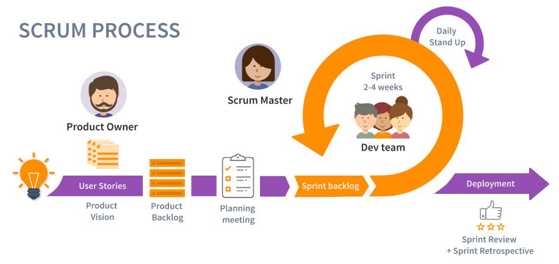

# AGILE 

## What is AGILE?

Agile project management is a project framework or "principles" that take an iterative approach towards the completion of a project. Such as ambiguity, scope creep, team burnout etc. Having a set of principles to base our project management structure helps combat these operational issues.

### AGILE Manifesto
The agile manifesto is a great starting point for anyone looking to familiarize themselves with the agile methodology. The manifesto outlines the 4 values and 12 principles of agile software development and was actually created by a group of software developers in an effort to provide a clear and alternative set of processes for developing software. Read the manifesto [here](https://agilemanifesto.org) 

The agile values include prioritizing: 

1. Individuals and Interactions Over Processes and Tools.
2. Working Software Over Comprehensive Documentation. 
3. Customer Collaboration Over Contract Negotiation. 
4. Responding to Change Over Following a Plan.  

### AGILE Methodologies

Agile refers to the methods and best practices for organizing projects based on the values and principles documented in the Agile Manifesto. However, depending on the type of project you are working on you amy want to implement Agile in different ways. There are many different types of methodologies to choose from. Here are some of the most common Agile frameworks:

1. Scrum
2. Kanban
3. Extreme Programming (XP)
4. Feature-driven development (FDD)
5. Dynamic Systems Development Method (DSDM)
6. Crystal
7. Lean

Scrum and Agile are related, but they are not the same thing. It's a specific methodology that provides a structure for implementing Agile principles in a team setting. In summary, Agile is a mindset, a philosophy, a set of values and principles, while Scrum is a methodology, a way of implementing Agile, with a specific set of roles, events and artifacts. Scrum is the preferred methodology for most cases, and is also highly used within Optum. To learn more about about the different Agile methodologies you can read [here](https://www.wrike.com/project-management-guide/faq/what-are-the-different-types-of-agile-methodologies/).

## Why Use Scrum?

- According to the PMI Pulse of the [Profession annual report](https://www.pmi.org/-/media/pmi/documents/public/pdf/learning/thought-leadership/pulse/pulse-of-the-profession-2018.pdf), 48% of projects are not finished within the scheduled time, 43% go over their original budget, and 31% of projects **don't meet the initial goals** and business intent. Agile Srum is particularly useful for projects with rapidly changing or highly uncertain requirements, as it allows teams to respond to change and adapt to new information throughout the development process.
- **Faster delivery** of working software
- Increased flexibility and ability to **adapt** to changing requirements
- Improved communication and **collaboration** among team members
- Greater visibility into the development process, which **facilitates better planning** and decision making
- Better customer and end-user involvement in the development process, which helps to ensure that the final product meets their needs and expectations.

## The Different Scrum Ceremonies

Scrum has a set of ceremonies, or meetings, that are designed to help the team stay organized and focused on the goals of the project. 
These usually are encapsulated in iterative time-boxes known as sprints, which last 2 weeks. 

| **Ceremony** | **Purpose** |
|---|---|
| **Daily Stand-Up** | A daily stand-up, also known as a daily scrum, is a short meeting that takes place every day at the same time during a sprint in an Agile software development process. The meeting is usually held in the morning and is attended by all the members of the development team, as well as the Scrum Master or project manager. The purpose of the daily stand-up is for the team members to quickly share what they did yesterday, what they plan to do today, and to report any obstacles or issues that are blocking their progress. The meeting is conducted in a round-robin format, with each team member taking a turn to speak. The meeting should be time-boxed to 15 minutes or less. The goal of the daily stand-up is to ensure that the team stays on track, that everyone is aware of what the other team members are working on, and that any issues or problems that arise can be addressed quickly. The daily stand-up helps to keep the team members accountable, It also helps to improve communication and coordination among the team members |
| **Sprint Planning** | The purpose of the sprint planning meeting is to plan the work that the team will complete during the upcoming sprint. The meeting is typically facilitated by the Scrum Master or project manager and is attended by the entire development team. During the sprint planning meeting, the team reviews the items in the product backlog and selects the highest-priority items to be included in the sprint. They also discuss the details of each item and break them down into smaller, manageable tasks. The team then estimates the effort required to complete each task and creates a sprint backlog, which is a list of all the tasks that need to be done during the sprint. Once the sprint backlog is created, the team sets a sprint goal, which outlines the objectives that need to be achieved during the sprint. |
| **Sprint Review/Retrospective** | A sprint retrospective, also known as a sprint retro, is a meeting that is held at the end of a sprint (a fixed period of time, typically two to four weeks, during which a specific amount of work is completed) in an agile software development process. The purpose of the sprint retrospective is for the team to reflect on their work during the sprint and identify areas for improvement. The team members discuss what went well during the sprint, what challenges they faced, and what could be done differently in the future. The goal is to identify and implement improvements that will lead to better performance and efficiency in future sprints. This meeting is usually facilitated by the Scrum Master or the project manager and it is open for all the team members. The outcome of the retrospective should be a list of action items that the team commits to implementing in the next sprint. |
| **Backlog Refinement** | Backlog refinement (also known as backlog grooming or story time) is a process in which the team responsible for a software development project reviews and updates the items in the product backlog, which is a prioritized list of work that needs to be done. During the refinement process, the team assesses the user stories in the backlog, clarifies requirements, estimates the effort required to complete each item, and reprioritizes the backlog as needed. The goal of backlog refinement is to ensure that the highest-priority items are clearly defined and ready for the team to work on, and that the backlog as a whole remains aligned with the overall goals of the project. |

## User Stories

In Scrum, a user story is a brief, informal description of a feature or requirement from the perspective of an end user. It is used to describe the desired outcome of a piece of work and serves as the basis for creating tasks and determining acceptance criteria. User stories are typically written in the format "As a [`user`], I want [`feature`], so that [`benefit`]." They are used in the Scrum framework to help team members understand the customer's needs and priorities, and to guide the development process. Informally, it's a bit pedantic to write stories like this all the time. Usually you can just write the tasks and a brief description. 

a user story typically goes through the following states or stages during its lifecycle:

1. **Backlog:** The user story is first added to the product backlog, which is a prioritized list of features and requirements that the team needs to work on.

2. **Grooming:** The team discusses and refines the user story during regular grooming sessions. They may break it down into smaller tasks, add acceptance criteria, and clarify any ambiguities or uncertainties.

3. **Defined:** The team selects user stories from the product backlog to work on during the upcoming sprint. They also create tasks and assign them to team members.

4. **In Progress:** The team starts working on the user story and its associated tasks during the sprint. They may update the status of the story as they make progress.

5. **Completed:** The team finishes working on the user story and its associated tasks. The story is then reviewed and accepted by the product owner or team memebers

6. **Done/Accepted:** The user story is considered done when it has been accepted by the product owner or team lead and the code has been deployed to production. Being accepted can also depend on the *Definition of Done (DoD)*.

It's worth to mention that there are different variations of the process and some organizations may use slightly different states, but overall this is the common flow.

---

## Glossary

???+ danger "Glossary"
    - **Velocity:** Velocity is a measure of the amount of work a Team can tackle during a single Sprint and is the key metric in Scrum. Velocity is calculated at the end of the Sprint by totaling the Points for all fully completed User Stories. 
    - **Capacity:** Capacity represents the amount of work that can be completed within a given time frame and is based on the number of hours a person or team has available to complete that work.
    - **Scrum Master:** A scrum master oversees the development process and acts as a problem solver for the team; preventing roadblocks and enforcing the agile way of doing things.  
    - **Backlog:** The backlog is the ever changing list of the software's requirements. It's not to be seen as a to do list so much as a prioritized list of desired features of the product provided by the stakeholders.  
    - **User Story:** A user story is an informal, general explanation of a software feature written from the perspective of the end user.
    - **Sprint:** A sprint is a short development phase for a specified time period. Sprints help prevent projects from feeling overwhelming and allows feedback to be given at appropriate junctures.
    - **Timeboxing:** Timeboxing is when you set a limit in the amound of time spent to accomplish a goal. This is extremely helpful in terms of productivity, and controlling the scale of a project.  
    - **Epic:** An agile epic is a body of work that can be broken down into specific tasks (called user stories) based on the needs/requests of customers or end-users
    - **Feature Creep:** When the features of a project expand, or new additional features are requested beyond the original scope. [See here](https://en.wikipedia.org/wiki/Feature_creep)
    - **Scope Creep:** This is loosely related to feature creep, but there is a distinction. This is when the scope of a project seems to be continuously changing due to poorly planned and documented scoping. [see here](https://en.wikipedia.org/wiki/Scope_creep)
    - **Product Owner:** The person responsible for creating and prioritizing the product backlog, and ensuring that the final product meets the needs of the stakeholders.
    - **Definition of Done (DoD):** A set of criteria that must be met before a product backlog item can be considered complete and ready for delivery.

## References

- [What Are Epics in Agile? Definition, Examples, and Tracking](https://kanbanize.com/agile/project-management/epics)
- [Agile vs. waterfall project management](https://www.atlassian.com/agile/project-management/project-management-intro)
- [What Are Agile Ceremonies?](https://kanbanize.com/agile/project-management/ceremonies)
- [Top 10 Agile Terms](https://number8.com/10-agile-project-management-terms-you-should-know/)
- [What are the Different Types of Agile Methodologies?](https://www.wrike.com/project-management-guide/faq/what-are-the-different-types-of-agile-methodologies/)