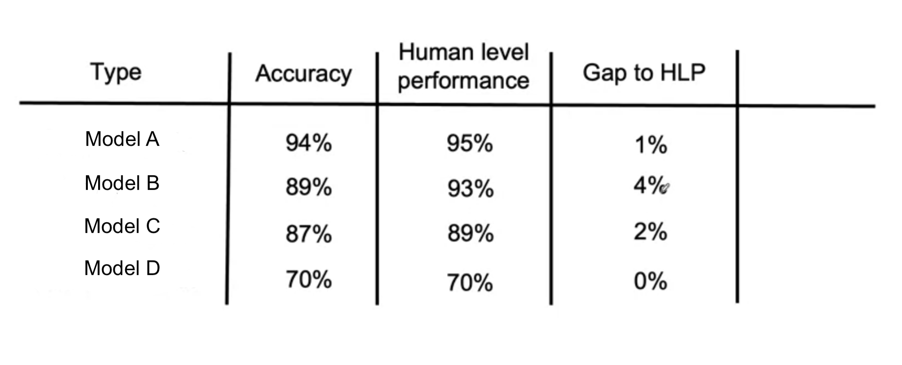

# Human Level Performance (HLP)

You often see academic papers rely on beating humans to perform specific tasks as a measure of success. However, there are some things to be aware of before doing this type performance evaluation.

## What is HLP? 

HLP is the evaluation of humans in the loop performing a task, that the proposed ML model(s) may be replacing or assisting. This is often used as baseline metric that the model must beat to prove value. This is done by having the humans perform the same task as the proposed model. Their answers are recorded and the evaluation metrics are calculated. 



## Issues with HLP

Let's take an example where several human evaluators classify cases of inpatient admission risk, where the outcome `y` is either a zero or one. A consensus is done: For a given sample 70% of the evaluators agree the person is of high risk, and 30% agree they are of low risk. We can calculate that 2 random humans will agree with eachother 58% of the time.

```python
consensus rate = 0.7^2 + 0.3^2 = 0.58
```

Now lets say that the ML model agrees with humans 70% of the time, that is a 12% increase in performance compared to HLP. However, this measure of comparing model vs human can be a red-herring as it can distract from the more significant errors the model may be producing.

## Improving HLP

If there is a disagreement (lets say +20% of the time) this could be due to the defintion of the label. It's worth checking how the label was defined because it could have just been made by another human, who have their own set of biases. When the ground truth is truly defined and humans share the same criteria for labelling a sample, the evaulation must be taken again.
Once the consensus rate is high enough only then will it safe to use HLP as a measure of success. 

Going back and getting them to redefine how they would label a sample can raise HLP to 100%. In certain circumstances, like when a model is being requested due to HLP being so low, there is a possibility that an ML model may not even be needed when it's discovered that the humans in the loop are given inconsistent labelling instructions. 


## Summary
- HLP is a common way of evaluating model performance, but is often misused in academic papers
- Done by comparing accuracy of model vs humans
- Before comparing the model to HLP, compare humans to themselves
- If there is a high disagreement rate among human evaluators then its worth checking the labelling criteria as ambiguous instructions can lead to inconsistent results
- Once the consensus rate is high enough its safe to use HLP as a baseline measure for success.