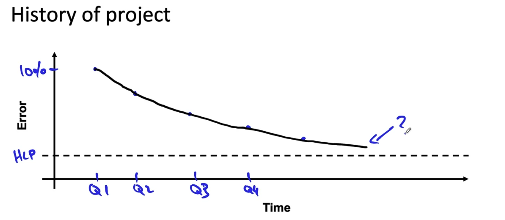

# Scoping a Project

Many challenges come with scoping out an ML project, such as ambiguity around requirements, how the solution should work or whether its even feasible to implement it. Having a good set of tools for navigating these operational speedbumps in development can help make your work more efficient

##  How to scope a project?

###  1. Identify the Business Problem

Firstly you should meet with a business or product owner, not someoneone technical. It's important to get as much information as possible from them, preferably in writing so there can be no ambiguity on the requirements. Here is a template list of questions to ask when beginning the scoping phase of a project. Some of these may seem very simple, but they can drastically reduce ambiguity and confusion:

- What is the "elevator pitch" for your problem? (one-liner)
- Can you give a detailed description of the problem?
- Is there an existing solution for this problem or is this a completely new project?
- How is the problem currently being addressed, are there humans currently performing this task?
- What are the business metrics for success?
- How many users do you expect to use this model? Should it be a batch report, an API or real-time solution? 
- Given a reasonable timeline, when would you expect this project to be in production?
- At what cadence should we meet? (weekly, bi-weekly, etc.)
- At the end of the project, what would you like to see? 

When you have a clear idea of what the business want, you should then meet with a technical SME or development team that works with the business. This will give you an opportunity for gathering technical information. Some questions may include:

- What data is needed for this project and how can we get access? 
- What is the latency of the data?
- Are there any known data quality issues?
- Are there PHI/PII concerns?
- How frequently can we request new data?
- If there is a technical solution already in place, can you give a walk through?
- Is there any record of data lineage or data provenance? 

### 2. Brainstorm Solutions

Your team should review the answers to the questions in the previous section and then to meet up. The purpose of this meeting should be to: 
- **a.** Identify possible ML models for this problem. This can be achieved by reviewing the current academic literature and using that as a goal to strive towards, or pitching a novel approach.  
- **b.** Address the feedback from step 1 and use that to plan the subsequent steps

It's important to also be self-critical before committing to building a solution. Some questions to ask amongst yourselves are:

- Do we have the capacity or bandwidth to tackle a project of this size?
- Do we have the skill set needed for this specific problem?
- How long would it take to up-skill? (estimate)
- Do we have time constraints?

### 3. Evaluate Technical Feasability

1. **Assessing feasability** - Before building a prototype of the project, you should use external benchmarks to assess the feasability of a project. This would inlcude reviewing recent academic literature, finding examples online or seeing if something similar was already implemented within with company. After you have brainstormed ideas, search through github and search the common terms associated with those ideas. 
2. **Benchmarking** - Depending on the type and maturity of project you are attempting to tackle, there are different ways of benchmarking. 
For unstructured data problems, assessing how humans perform on a task can be a good future predictor of project success. If a human, given the same set of data, can perform a task well then that will give you an early indication that the problem will be easy or hard to solve. Read more about how to assess using HLP [here](./hlp.md). For structured data problems, HLP may not be suitable as humans are generally worse at assessing structured data. When you have a set of features and a label, you should perform some [predictive feature analysis](https://machinelearningmastery.com/feature-selection-with-real-and-categorical-data/) to get a sense whether the data you have is useful or not

For already existing projects, using the project history can give a good benchmark. Lets say you have a system that is already in place to perform some task for humans. One way of seeing trends of the current system would be to assess their performance for different time periods (like once a quarter), as well as HLP within those time periods. The idea here is to see how the existing system in place has reduced error percentage relative to HLP. For example, if their current system has a 30% reduction in error each quarter relative to humans, then that is a potential benchmark that we want to beat.

When you have completed identifying the business problem, came up with possibles solutions and have assessed the feasability, you should write a technical feasability document. This is essentially a write up of your understanding of the problem and how you aim to solve it. It's useful because the development team can have all the specifications on paper to review and add suggestions where suitable, and can lower ambiguity and misunderstandings. Copy the contents of the [Technical Feasability Document Template](./technical_feasability_template.txt) and paste to a markdown file.

### 4. Determine Milestones

After understanding the problem well, determining how to approach the problem and assess feasability it's time to set milestones. Determinining milestones for your project will require laying our key specifications:

- ML Metrics (Accuracy, F1, Precision, Recall, etc.)
- Software metrics (latency, throughput, etc)
- Business Metrics (revenue, cost reduction, time saved, etc.)
- Resources needed (data, people, external team collaboration)
- Timeline (when you hope to complete milestones)

If you are unsure about any of these, consider some benchmarking or building a ad-hoc model to use that information for a estimating a larger scale execution. 

### 5. Writing a Project Proposal

When you have completed the scoping of the project you will now need to write a project proposal. The purpose of this document is to highlight the purpose of the project, what is needed from a technical and functional aspect, define deliverables and establish times and dates when to touch base and discuss progress and to discuss potential project risks. This should reduce ambiguity on what should be delivered and set reasonable expectations. 

- Download the [**Project Proposal Document Template**](./proposal_document_template.docx). Explanations of each section are highlighted in green within the document.

## References
- [IDP Technical Feasability Document Template](./technical_feasability_template.txt)
- [IDP Project Proposal Document Template](./proposal_document_template.docx)
- [How to Choose a Feature Selection Method For Machine Learning](https://machinelearningmastery.com/feature-selection-with-real-and-categorical-data/)