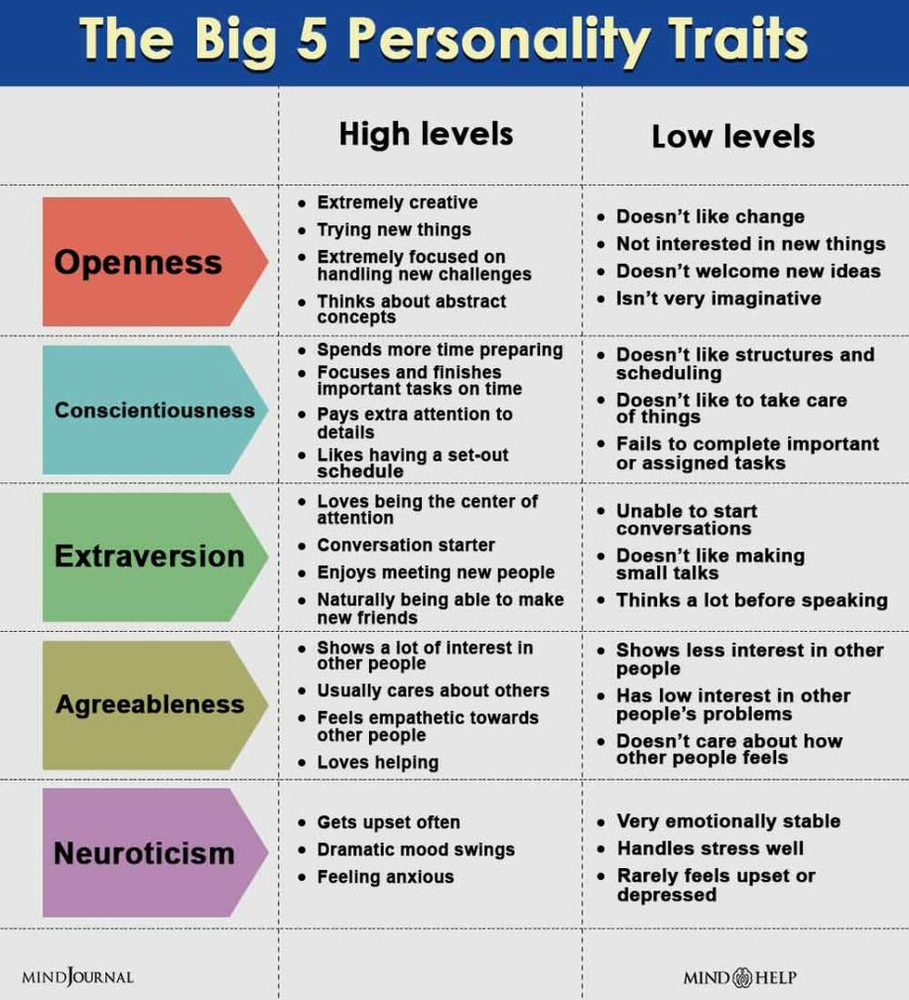
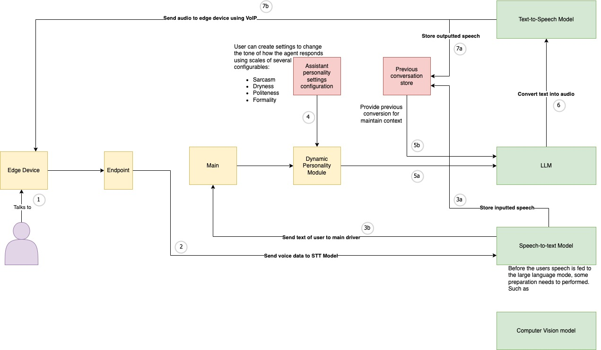

# Scoping Project v0.0.1

*26th March 2023*

???+ note
    This is done without any field research done. Its just initial brainstorming and building an intuition of how the system *might* look. 

## Brainstorm of Feature Ideas

- Lets say a blind or visually imparied person is looking for something in a market or a library, imagine they have an AI assistant that aids them in their daily tasks. 
    - The user could talk to their assistant and say "Hey, i'm going to go to the market to pick up some milk and bread". The assistant should have the ability to maintain that information and understand the context in which way it should help. IE: When the assistant sees that the user is in the store, it should be able to recall the previous prompt or conversation when the user was talking about the items they required. For this a a few technologies would be required: 
        1. **Computer vision** for classifying video feed. Its uncertain if this inference can be done on the edge device or if it must be done in the cloud. Most likely will be cloud, 
        2. **A Large Language Model**. This is used for maintaining a conversational aspect to the assistant. LLM's such as ChatGPT have blown all other methods of producing chatbots we have ever seen. Big bets were placed on previous attempts such as Facebooks Chatbot developer SDK which allowed developers to create chatbots using Messenger. However, these chatbots where mostly rule based and did not provide a natural feeling experience. It really just slowed done being able to find the information you need that could have been easily solved by a simple google search. Therefore, using a generalized pretrained model is crucial for providing the feeling of authenticity within the conversations the user may have with it. Some alteratioins will be needed to this model. The details are unkown as of yet, but this LLM will need to have the ability to intake data from the output of the computer vision algorithm. This would require either two LLMs (one for conversations and another for interpreting what the CV algorithm is classifying in the moment), alternatively; a refactored model that takes two inputs: user input or classification input. There would also need to be a system that ties all of these together in real-time. 
        3. **Speech To Text** will be needed to interpret what is being said by the user into data that the LLM can work with (tokens). Its currently unknown if this could be done on edge or if it would require transcription to be done in the cloud.
        4. **Text To Speech** is required to provide a vocal output to the user. The output response from the LLM system would be synthesized by some speech synthesis model. It would need to be omptimized for quick inference times to improve latency. Possible the audio could be generated on edge by sending instructions to the device. Its also possible that the audio could be transferred from the cloud, via [VoIP](https://www.fcc.gov/general/voice-over-internet-protocol-voip#:~:text=Voice%20over%20Internet%20Protocol%20(VoIP)%2C%20is%20a%20technology%20that,(or%20analog)%20phone%20line.)
- **Personality Module:** To provide a unique experience and the illusion of the assistant having a personality would require some regulatory system running in the background. It should be able to have a configurable personality setting, where the user can select on which scale that what certain aspects of the assistants "personality" should be. This should be based on a valid personality traid model. There are many personality models out there, but the **The Big Five Personality Traits** model is generally considered the most widely accepted and used model for measuring personality. The Big Five model has gained popularity due to its ability to provide a comprehensive understanding of personality and its applicability in various fields, including psychology, organizational behavior, and marketing. Moreover, research has supported the validity and reliability of the Big Five model across cultures and languages.

The configurations of the assistants persona should be interpretable by the LLM, and should influence the type of response the LLM produces. This system should be dynamic, meaning the parameters for the persona should be updating consistently throughout the span of conversations had with the assitant. The responses returned from the LLM should be analysis using sentiment analysis. Some system should be in place the use the output of the sentiment analysis to regulate the persona parameters. For example: If the user speaks with apathy towards the assistant then the responses wouldn't be as cheerful. Doing so would break the illusion of an authentic artificial personality. 
- **Edge Device:** Ideally, to provide the best experience this should be wearable device such as glasses.

## Proposed system Architecture

1. User speaks to edge device. It is unknown as of yet whether or not speech to text happens on the edge device or on the cloud. Right now it's assumed that is doesn't.
2. The request reaches an endpoint, to where its sends the speech audio to a Text-To-Speech model to be turne
3. ...