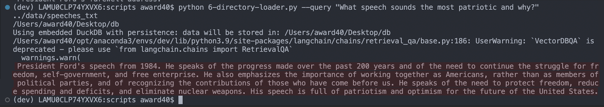

# Project Scoping v0.0.10

*27th April 2023*

**Side projects**

- Made a ChatGPT document query system with LangChain, in which i downloaded a large dataset of all the speeches/national addresses from US presidents. I spliced the text up into chunks of 1000 tokens and used OpenAI Embeddings. These were stored in a Chroma vector database. The script would then take an argument called `--query` followed by a question to ask the model. Below is an example where i asked "what is the most patriotic speech and why?"

- I also played around with some of the other components. My take is that Langchain is still in it's infancy at the moment so there is a lot of bugs that need to be ironed out. There was some issues with getting things working - for example the `RecursiveCharacterTextSplitter` and `YoutubeLoader`, so hopefully they will be fixed soon.

**News**

- [Recurrent Memory Transformers](https://arxiv.org/abs/2207.06881)

> Transformer-based models show their effectiveness across multiple domains and tasks. The self-attention allows to combine information from all sequence elements into context-aware representations. However, global and local information has to be stored mostly in the same element-wise representations. Moreover, the length of an input sequence is limited by quadratic computational complexity of self-attention.
>In this work, we propose and study a memory-augmented segment-level recurrent Transformer (RMT). Memory allows to store and process local and global information as well as to pass information between segments of the long sequence with the help of recurrence.
>We implement a memory mechanism with no changes to Transformer model by adding special memory tokens to the input or output sequence. Then the model is trained to control both memory operations and sequence representations processing.
> Results of experiments show that RMT performs on par with the Transformer-XL on language modeling for smaller memory sizes and outperforms it for tasks that require longer sequence processing. We show that adding memory tokens to Tr-XL is able to improve its performance. This makes Recurrent Memory Transformer a promising architecture for applications that require learning of long-term dependencies and general purpose in memory processing, such as algorithmic tasks and reasoning.