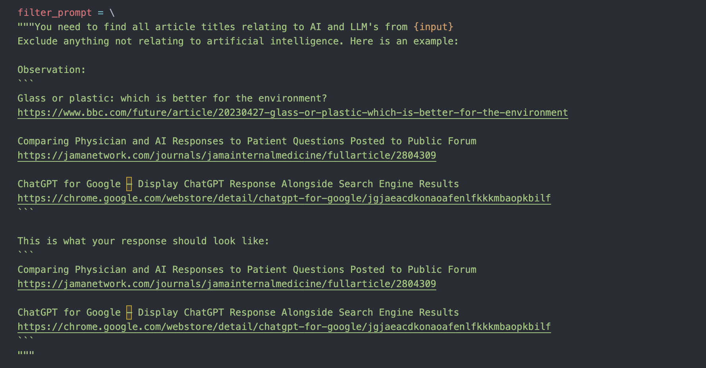
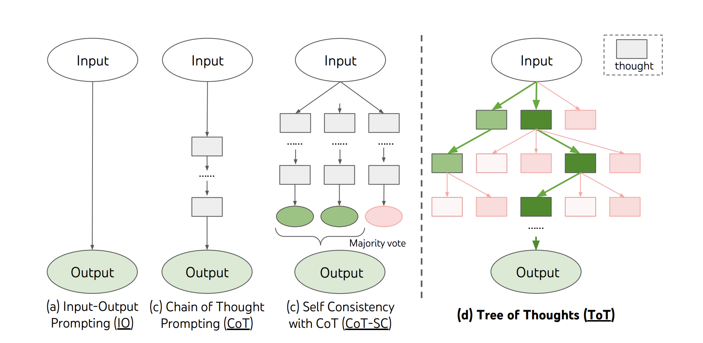

# Project Scoping v0.0.11

*29th May 2023*

- I took a bit of a break from writing. Time to get back into it. Anyways, some interesting stuff has been happening in terms of new Open sourced models. There has been some cool applications of langchain. 
- In my own langchain work, i half-made a Langchain application that took a URL (in this case it was hacker news) and web scrape the latest titles on the main webpage. I told the LLM to extract the title and the url if it contained any mention of AI/ML/GPT/LLM's etc. The model would then use an agent to iteratively go through the links and produce a summary of the article. I didn't get this far for a few reasons: The SerpAPI, used for searching google, is super expensive. And because i got busy so i didn't have the time.. I will come back to it eventually. 

- I also did some introductory tutorials with Langchain. Heres [the PR](https://github.com/tempnamefornow/ar-assistant/pull/3) for that work
- Discovered streamlit, which is a lightweight python library for making dashboards. [https://streamlit.io](https://streamlit.io)

### AI news:

- **Falcon model**: A massive base model from Technological Innovation Institute. They released a 7B and 40B Parameter model. 
- Their license states that the model is free, up until you make more than $1M dollars annually, then you need to pay a 10% royalty for using the model.
- [https://falconllm.tii.ae/](https://falconllm.tii.ae/)
- [https://huggingface.co/tiiuae](https://huggingface.co/tiiuae)

<iframe width="560" height="315" src="https://www.youtube.com/embed/5M1ZpG2Zz90" title="YouTube video player" frameborder="0" allow="accelerometer; autoplay; clipboard-write; encrypted-media; gyroscope; picture-in-picture; web-share" allowfullscreen></iframe>

- **Samantha**: A companian based LLM, aligned in a way to add personality the model. The character is inspired by the movie Her. A 7, 13 and 33 Billion parameter versions have been released.
- Dataset was distilled from GPT 4.5. IE: got chatgpt to make a dataset for them. 
- [https://huggingface.co/ehartford/samantha-7b](https://huggingface.co/ehartford/samantha-7b)

<blockquote class="twitter-tweet">
Meet Samantha { by Eric Hartford } from <a href="https://twitter.com/hashnode?ref_src=twsrc%5Etfw">@hashnode</a> <a href="https://t.co/sfuuOeeYaa">https://t.co/sfuuOeeYaa</a> I released models on huggingface, samantha-7b and samantha-13b. As many have asked me why and how, I have written a blog post to explain.<a href="https://t.co/J89ti3RwWu">https://t.co/J89ti3RwWu</a><a href="https://t.co/hiJfq3kii5">https://t.co/hiJfq3kii5</a>
&mdash; Eric Hartford (@erhartford) <a href="https://twitter.com/erhartford/status/1662931139638751232?ref_src=twsrc%5Etfw">May 28, 2023</a></blockquote> 

- **Tree of Thoughts: Deliberate Problem Solving with Large Language Models**: An effective way of problem solving, whereby you don't accept the first answer from an LLM, but create a tree search over the outputs of the model. The LLM Rates the outputs of these tree states. This helps in cases where investigation and planning is needed in a task. 
- From Google deep mind.
- [Paper](https://arxiv.org/abs/2305.10601)

<iframe width="560" height="315" src="https://www.youtube.com/embed/ut5kp56wW_4" title="YouTube video player" frameborder="0" allow="accelerometer; autoplay; clipboard-write; encrypted-media; gyroscope; picture-in-picture; web-share" allowfullscreen></iframe>

