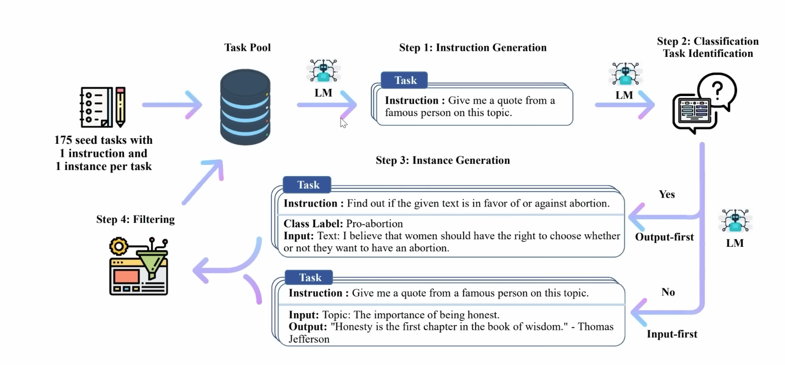
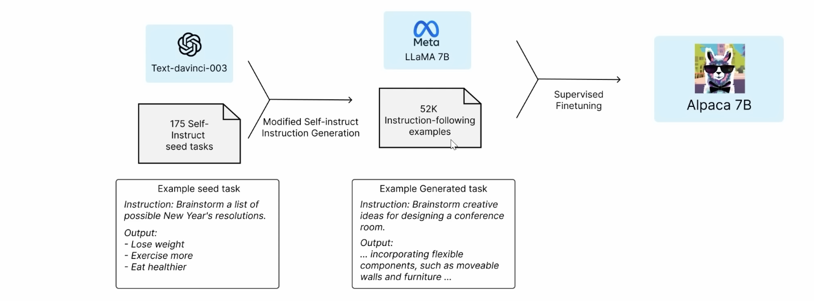
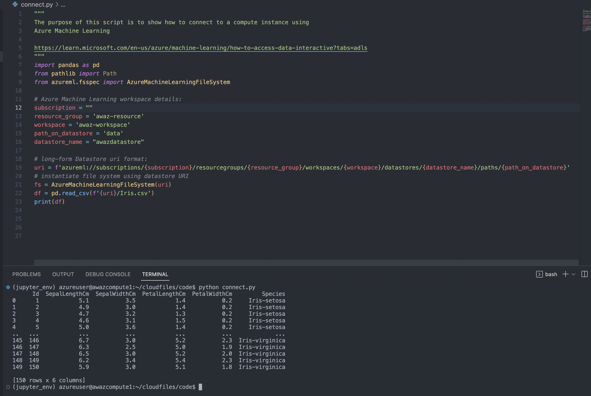

# Project Scoping v0.0.3

*30th March 2023*

## Notes

- Found out about research done by standford, in which developed to have comparable performance to chatgpt 3.5 turbo (text-davinci-003).
   - The model is based on a LLaMa model, which was open sourced by Facebook. The model they used was the weakest, 7 Billion parameter. Then they used Chatgpt 3.5 to train the model. The did this using a method called [Self Instruct](https://arxiv.org/pdf/2212.10560.pdf), which allows models to learn without any human supervision. IE: a model training another model.
   
   - OpenAI state in their terms of service that you can used this for commercial purposes. OpenAI are freaking out about this. Note that they used the smallest of the open sourced LLaMa models, and trained it for just $600. This has caused a rush in ChatGPT copies, in under 3 hours. LLMs are getting cheap fast.

<iframe width="560" height="315" src="https://www.youtube.com/embed/xslW5sQOkC8" title="YouTube video player" frameborder="0" allow="accelerometer; autoplay; clipboard-write; encrypted-media; gyroscope; picture-in-picture; web-share" allowfullscreen></iframe>

   - So that brings us to Alpaca. Here is how it works: Stanford used ChatGPT to create thousands of instruction following examples, they then used an open sourced LLaMA model. 
   
- Found out about a open source model called GPT4All, [released on github.](https://github.com/nomic-ai/gpt4all). Its based on LLaMA. 
   - Nomic, the company that released the model, does visualization software for data. They used a few datasets from stackoverflow, hugging face etc. with prompt and responses to generate. They used the official ChatGPT API to filter out the bad responses. They then took the LLaMA Module and did fine tuning using that LoRA. They release their checkpoint in Hugging face, titles [`gpt4all-lora`](https://huggingface.co/nomic-ai/gpt4all-lora)
- In other news, Google released the [PaLM](https://developers.googleblog.com/2023/03/announcing-palm-api-and-makersuite.html). Which give you access to Google’s large language models using the API. 
- I set up a compute instance on Azure ML, and connected a storage account to read in data. Am able to connect to blob and also write to the blob container. It took hours...
   

---

## Azure ML Setup

- [Azure Machine Learning Introduction: Part 1 Overview and prep work](https://www.red-gate.com/simple-talk/cloud/data-science/azure-machine-learning-introduction-part-1-overview-and-prep-work/)

## How to connect Azure Blob to Azure ML

**Assign managed identity**
- [Link](https://learn.microsoft.com/en-us/azure/machine-learning/how-to-create-manage-compute-instance?tabs=python#assign-managed-identity)

You can assign a system- or user-assigned managed identity to a compute instance, to authenticate against other Azure resources such as storage. Using managed identities for authentication helps improve workspace security and management. For example, you can allow users to access training data only when logged in to a compute instance. Or use a common user-assigned managed identity to permit access to a specific storage account.

You can create compute instance with managed identity from Azure Machine Learning Studio:

- Fill out the form to create a new compute instance.
- Select Next: Advanced Settings.
- Enable Assign a managed identity.
- Select System-assigned or User-assigned under Identity type.
- If you selected User-assigned, select subscription and name of the identity.
- I got to ingest data by using `ContainerClient` and `azureml://subscriptions` uri.

## How to install and run GPT4All

<iframe width="560" height="315" src="https://www.youtube.com/embed/GhRNIuTA2Z0" title="YouTube video player" frameborder="0" allow="accelerometer; autoplay; clipboard-write; encrypted-media; gyroscope; picture-in-picture; web-share" allowfullscreen></iframe>

<iframe width="560" height="315" src="https://www.youtube.com/embed/DDfUoQWnrfM" title="YouTube video player" frameborder="0" allow="accelerometer; autoplay; clipboard-write; encrypted-media; gyroscope; picture-in-picture; web-share" allowfullscreen></iframe>

