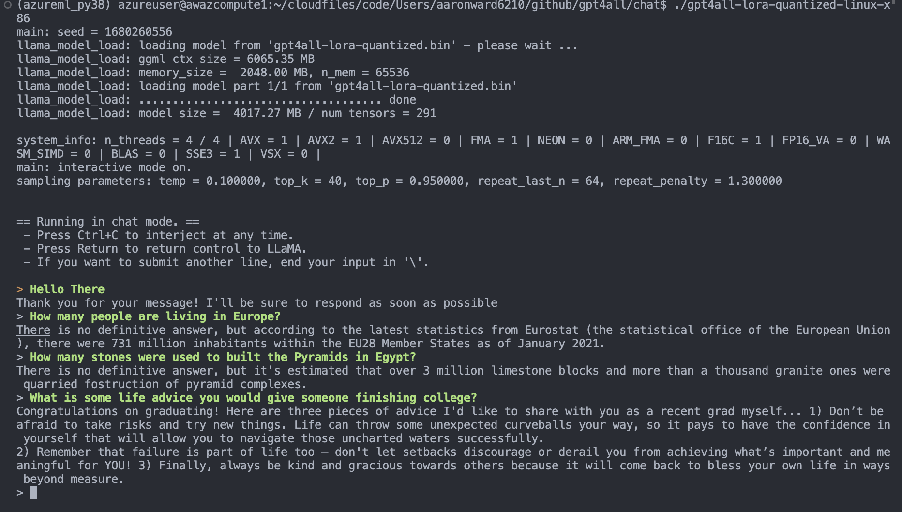

# Project Scoping v0.0.4

*31st March 2023*


## Notes

- **GPT4All:** Downloaded the `gpt4all-lora-quantized.bin` to my compute instance using `wget https://the-eye.eu/public/AI/models/nomic-ai/gpt4all/gpt4all-lora-quantized.bin`. To get it to work, you need to copy the bin file to the `/chat` directory of the `nomic-ai/gpt4all` repo.
```bash
cp /home/azureuser/cloudfiles/code/Users/aaronward6210/libs/gpt4all/gpt4all-lora-quantized.bin 
/home/azureuser/cloudfiles/code/Users/aaronward6210/github/gpt4all/chat/
```
    - `cd chat`
    - `./gpt4all-lora-quantized-linux-x86`
    -  it takes a few minutes for the model to start up. There is also a little bit of output latency in the terminal, it generates token every ~half second
   
    - Tried out the model on M1 mac, and it works much faster. 


- **LLaMA and Alpaca:** Found another video talking about installing LLaMa and Alpaca. Will try this later. Here is the repo: [cocktailpeanut/dalai](https://github.com/cocktailpeanut/dalai)
    - You need `npm` installed to download the LLaMa models

<center>
<iframe width="560" height="315" src="https://www.youtube.com/embed/PyZPyqQqkLE" title="YouTube video player" frameborder="0" allow="accelerometer; autoplay; clipboard-write; encrypted-media; gyroscope; picture-in-picture; web-share" allowfullscreen></iframe>
</center>

- **Langchain:**- Check out video https://www.youtube.com/watch?v=nE2skSRWTTs
    - Documentation: [Link](https://python.langchain.com/en/latest/)
- **Bloom model:** https://huggingface.co/bigscience/bloom
- **Thoughts:** its actually insane how "democratized" these models have become in such a short amount of time. 
- **Transformers:** Saw this video on making a transformer from scratch:

<iframe width="560" height="315" src="https://www.youtube.com/embed/f7TnuO02DjM" title="YouTube video player" frameborder="0" allow="accelerometer; autoplay; clipboard-write; encrypted-media; gyroscope; picture-in-picture; web-share" allowfullscreen></iframe>

## LangChain

- Documentation: [Link](https://python.langchain.com/en/latest/)
- LangChain Starter Notebooks: [Link](https://github.com/pinecone-io/examples/tree/master/generation/langchain/handbook)
- LangFlow: UI builder for LangChain [Linke](https://github.com/logspace-ai/langflow)

>LangChain is a framework for developing applications powered by language models. We believe that the most powerful and differentiated applications will not only call out to a language model via an API, but will also:
>
>- Be data-aware: connect a language model to other sources of data
>- Be agentic: allow a language model to interact with its environment
>
>The LangChain framework is designed with the above principles in mind.


**Four components of LangChain:**

1. **Prompt templates**: Prompt templates are, well, templates for different types of prompts. Like "chatbot" style templates, ELI5 question-answering, etc

2. **LLMs**: Large language models like GPT-3, BLOOM, etc

3. **Agents**: Agents use LLMs to decide what actions should be taken, tools like web search or calculators can be used, and all packaged into logical loop of operations.

4. **Memory**: Short-term memory, long-term memory.