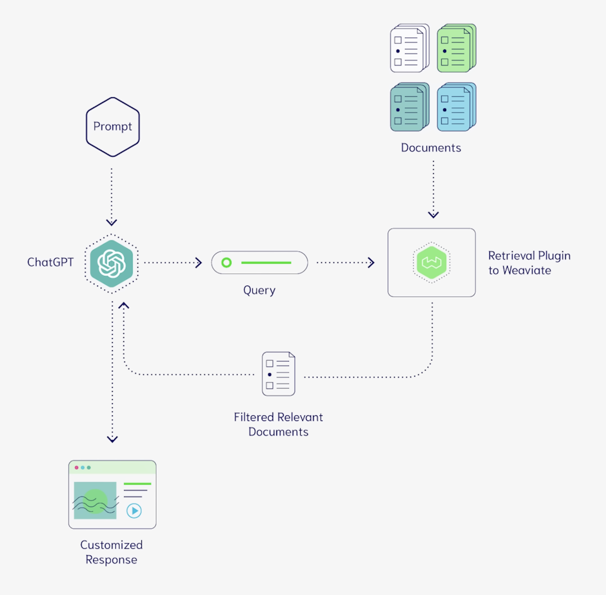

# Project Scoping v0.0.4

*13st April 2023*

## Notes

- I've been away for a while so its hard to remain caught up on all that has been going on. But to be fair, its hard for even someone who has all the time in the world to remain up to date in whats going on. There has been a groundbreaking releases of the use of LLMs in the passed few weeks. 
- I will list here just some of the main ones that I found:

| Name                                                                                                                                                                    | Release Date | Github Link                                        |
|-------------------------------------------------------------------------------------------------------------------------------------------------------------------------|--------------|----------------------------------------------------|
| [Auto-GPT: An Autonomous GPT-4 Experiment](https://www.livemint.com/technology/tech-news/meet-autogpt-the-autonomous-gpt-4-tool-revolutionizing-ai-11681358612615.html) | ?            | https://github.com/Torantulino/Auto-GPT            |
| [EasyLM: one stop solution for pre-training, finetuning, evaluating and serving LLMs in JAX/Flax](https://github.com/young-geng/EasyLM/blob/main/docs/README.md)        | ?            | https://github.com/young-geng/EasyLM               |
| [Reflexion: an autonomous agent with dynamic memory and self-reflection](https://arxiv.org/abs/2303.11366)                                                              | 20th March   | https://github.com/noahshinn024/reflexion          |
| [HuggingGPT: Solving AI Tasks with ChatGPT and its Friends in HuggingFace](https://arxiv.org/abs/2303.17580)                                                            | 2nd April    | https://huggingface.co/spaces/microsoft/HuggingGPT |
| [Koala: A Dialogue Model for Academic Research](https://bair.berkeley.edu/blog/2023/04/03/koala/)                                                                       | 3rd April    |

**[Vector Databases](https://www.pinecone.io/learn/vector-database/)**

- Another notable find is the use of vector databases. Vectors can represent high dimensional data such as words, images etc. in an **embedding**. This will group similar objects together. When you have the embeddings, you need somewhere to store them. Thats where vector databases come in. This can queried at ultra-low latency.  These can used in AI driven applications to give the models long term memory.

- Here are some examples of Vector DB's:
    - [Postgres PGVector](https://github.com/pgvector/pgvector): Open-source vector similarity search for Postgres
    - [Redis Redisearch](https://redis.io/docs/stack/search/): ediSearch is a source-available Redis module that enables querying, secondary indexing, and full-text search for Redis. These features enable multi-field queries, aggregation, exact phrase matching, numeric filtering, geo filtering and vector similarity semantic search on top of text queries.
    -  [Weaviate](https://weaviate.io/): Weaviate is an open-source vector database. It allows you to store data objects and vector embeddings from your favorite ML-models, and scale seamlessly into billions of data objects.
    - [Milvus](https://milvus.io/): Store, index, and manage massive embedding vectors generated by deep neural networks and other machine learning (ML) models.
    - [Pinecone](https://www.pinecone.io/) (**not open-sourced**): The Pinecone vector database makes it easy to build high-performance vector search applications. Developer-friendly, fully managed, and easily scalable without infrastructure hassles.
    - [Chroma](https://www.trychroma.com/): Chroma is a database for building AI applications with embeddings. It comes with everything you need to get started built in, and runs on your machine.

### Videos

**Koala**

<iframe width="560" height="315" src="https://www.youtube.com/embed/AZUTsp9Et-o" title="YouTube video player" frameborder="0" allow="accelerometer; autoplay; clipboard-write; encrypted-media; gyroscope; picture-in-picture; web-share" allowfullscreen></iframe>

<iframe width="560" height="315" src="https://www.youtube.com/embed/kSLcedGSez8" title="YouTube video player" frameborder="0" allow="accelerometer; autoplay; clipboard-write; encrypted-media; gyroscope; picture-in-picture; web-share" allowfullscreen></iframe>

**Vector Databases**

<iframe width="560" height="315" src="https://www.youtube.com/embed/klTvEwg3oJ4" title="YouTube video player" frameborder="0" allow="accelerometer; autoplay; clipboard-write; encrypted-media; gyroscope; picture-in-picture; web-share" allowfullscreen></iframe>

**Misc.**

<iframe width="560" height="315" src="https://www.youtube.com/embed/8JGfq2qqQ2Q" title="YouTube video player" frameborder="0" allow="accelerometer; autoplay; clipboard-write; encrypted-media; gyroscope; picture-in-picture; web-share" allowfullscreen></iframe>

