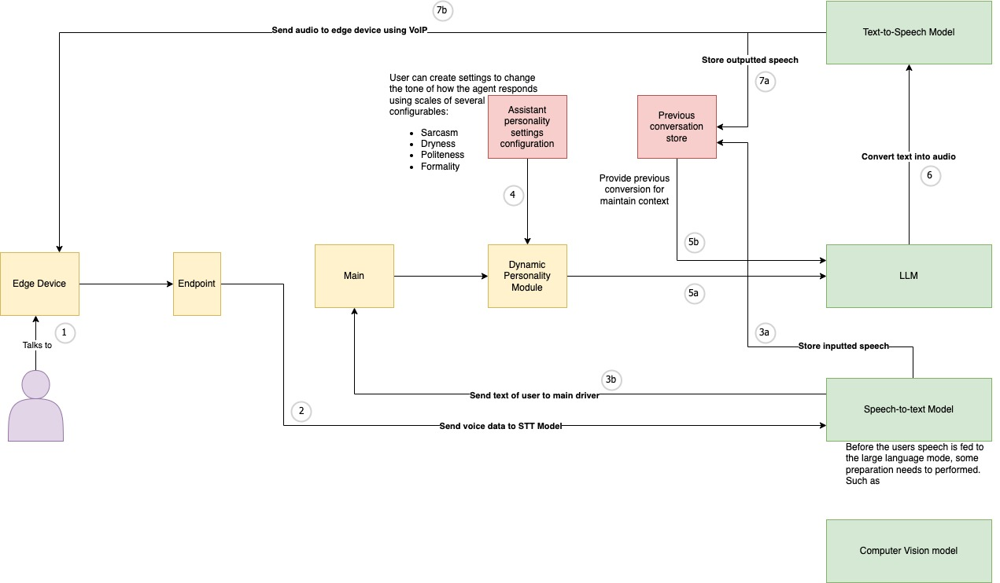

# Scoping Project v1

*26th March 2023*

1. User speaks to edge device. It is unknown as of yet whether or not speech to text happens on the edge device or on the cloud. Right now it's assumed that is doesn't.
2. The request reaches an endpoint, to where its sends the speech audio to a Text-To-Speech model, 